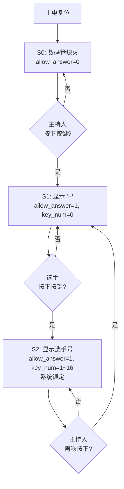
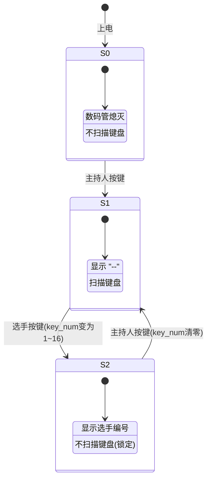
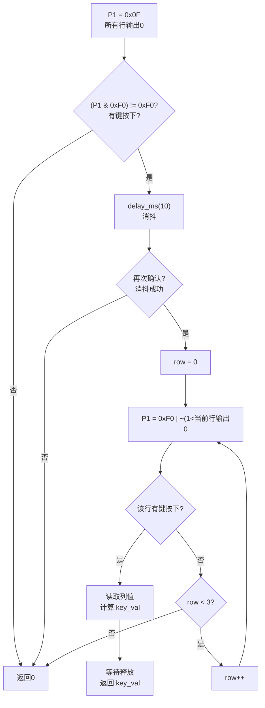
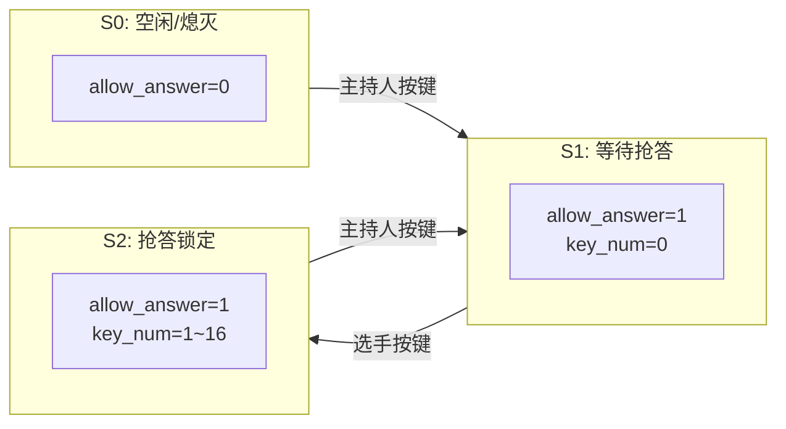
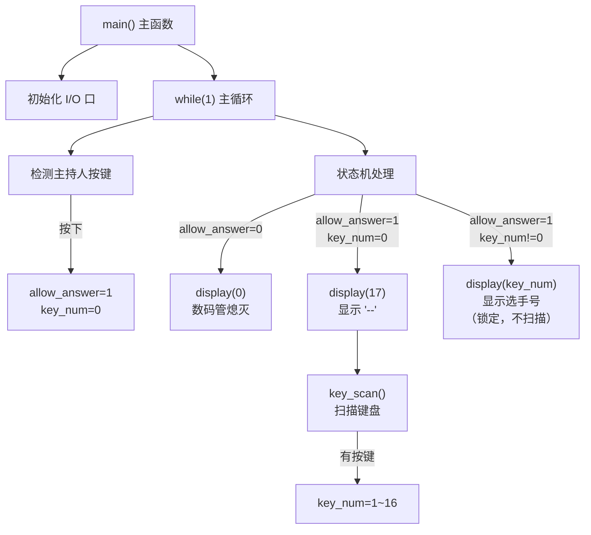

# 16路抢答器系统总结笔记

> [!abstract] 项目简介
> 本项目基于 AT89C51 单片机设计一个 16 路抢答器，支持 1 位主持人 + 16 位选手。系统通过两位共阴极数码管显示状态和选手编号，使用 4x4 矩阵键盘作为选手输入，主持人按键控制抢答流程。项目从零开始，分 7 个阶段逐步完成，最终整合为完整的状态机程序。

---

## 目录

- [[#第一部分：项目总览（解题导向）]]
  - [[#1.1 题目要求原文]]
  - [[#1.2 系统功能分析]]
  - [[#1.3 硬件连接总览]]
  - [[#1.4 系统工作流程图]]
  - [[#1.5 状态机设计]]
- [[#第二部分：分阶段实践（新手讲解导向）]]
  - [[#阶段 1：LED 闪烁]]
  - [[#阶段 2：独立按键检测]]
  - [[#阶段 3：数码管静态显示 0-9]]
  - [[#阶段 4：二位数码管显示 0~99]]
  - [[#阶段 5：二位数码管显示两条杠]]
  - [[#阶段 6：矩阵键盘扫描显示 1~16]]
  - [[#阶段 7：状态机与完整抢答器]]
- [[#第三部分：完整版代码解析]]
  - [[#3.1 完整代码]]
  - [[#3.2 代码架构分析]]
  - [[#3.3 关键模块解析]]
- [[#第四部分：知识总结与附录]]
  - [[#4.1 核心知识点清单]]
  - [[#4.2 段码速查表]]
  - [[#4.3 位操作速查]]
  - [[#4.4 常见错误排查表]]
  - [[#4.5 开发工具参考]]

---

## 第一部分：项目总览（解题导向）

### 1.1 题目要求原文

> 电路如右图所示，使用单片机设计一个十六路抢答器，具体要求如下：
> 系统上电后数码管处于灭的状态，当按下主持人按键时，数码管显示"--"，此时允许16位选手进行抢答，系统能够将最先抢答的选手号通过数码管显示（若13号选手按下选手按键，则数码管显示13），并锁定系统禁止其他选手抢答，当再次按下主持人按键时，系统清除前一次的选手号，数码管重新显示"--"，新一轮抢答开始。

### 1.2 系统功能分析

#### 输入设备

| 输入 | 引脚 | 说明 |
|------|------|------|
| 主持人按键 | P3.7 | 低电平有效，外接 10k 上拉电阻 |
| 选手按键 S1~S16 | P1.0~P1.7 | 4x4 矩阵键盘，行列扫描 |

#### 输出设备

| 输出 | 引脚 | 说明 |
|------|------|------|
| 十位数码管 | P0（段码）+ P2.0（位选） | 低电平选通 |
| 个位数码管 | P0（段码）+ P2.1（位选） | 低电平选通 |

#### 系统状态

| 状态 | 数码管显示 | 键盘扫描 | 触发条件 |
|------|-----------|---------|---------|
| S0：空闲/熄灭 | 全灭 | 禁止 | 上电初始 |
| S1：等待抢答 | `--` | 允许 | 主持人按下 |
| S2：抢答锁定 | 选手编号 | 禁止 | 选手抢答成功 |

### 1.3 硬件连接总览

```
AT89C51 单片机引脚分配表
┌──────────┬──────────────────────────────────────────┬──────────────┐
│  引脚    │  连接设备                                 │  备注        │
├──────────┼──────────────────────────────────────────┼──────────────┤
│  P0.0~7  │  数码管段码 a,b,c,d,e,f,g,dp             │  需外接上拉  │
│  P1.0~3  │  矩阵键盘行线（输出）                     │              │
│  P1.4~7  │  矩阵键盘列线（输入）                     │  内部上拉    │
│  P2.0    │  十位数码管位选                           │  低电平有效  │
│  P2.1    │  个位数码管位选                           │  低电平有效  │
│  P3.7    │  主持人按键                               │  低电平有效  │
│  XTAL    │  12MHz 晶振                              │              │
└──────────┴──────────────────────────────────────────┴──────────────┘
```

> [!warning] P0 口必须外接上拉电阻
> AT89C51 的 P0 口内部是开漏输出，输出高电平时呈高阻态，无法驱动数码管。必须外接 4.7k~10k 上拉电阻至 VCC。此外，每个段码引脚（a~dp）与 P0 口之间需串联 300~470 欧姆限流电阻。

#### Proteus 仿真电路图

> [!tip] 仿真电路截图
> ![[完整系统-Proteus仿真电路图.png|700]]
>
> *截图说明：16路抢答器完整 Proteus 仿真电路图，包含 AT89C51、两位共阴极数码管、4x4 矩阵键盘、主持人按键等。请将截图放入本笔记同目录下，文件名为 `完整系统-Proteus仿真电路图.png`。*

### 1.4 系统工作流程图



### 1.5 状态机设计



> [!tip] 状态机的核心思想
> 用 `allow_answer` 和 `key_num` 两个变量的组合来表示三种状态：
> - `allow_answer=0` --> S0（熄灭）
> - `allow_answer=1, key_num=0` --> S1（等待抢答）
> - `allow_answer=1, key_num!=0` --> S2（锁定）
>
> 锁定的实现方式非常巧妙：在 S2 分支中**不再调用 `key_scan()`**，后续选手的按键自然被忽略。

---

## 第二部分：分阶段实践（新手讲解导向）

> [!info] 学习路径说明
> 本项目按照由简到繁的顺序分为 7 个阶段，每个阶段在前一个基础上增加新功能。建议按顺序学习，每个阶段都动手实践后再进入下一阶段。

---

### 阶段 1：LED 闪烁

> [!note] 学习目标
> - 掌握单片机 I/O 口的基本输出控制
> - 理解延时函数的实现原理
> - 学会 `while(1)` 无限循环的使用
> - 了解软件延时与晶振频率的关系

#### 硬件连接

| 元件 | 连接方式 |
|------|---------|
| LED 正极（长脚） | 接 VCC（+5V） |
| LED 负极（短脚） | 串联 470 欧姆电阻后接 P1.0 |
| 晶振 | 12MHz |

> [!note] 低电平点亮
> 当 P1.0 输出低电平（0V）时，电流从 VCC 经 LED、电阻流入 P1.0，LED 点亮。输出高电平（5V）时，两端电压相等，无电流，LED 熄灭。

#### 仿真效果图

> [!tip] Proteus 仿真截图
> ![[阶段1-LED闪烁-仿真截图.png|600]]
>
> *截图说明：LED 以 500ms 间隔闪烁的 Proteus 仿真运行效果。请将截图放入本笔记同目录下，文件名为 `阶段1-LED闪烁-仿真截图.png`。*

#### 完整代码

```c
/*********************************************
 * 阶段1：LED闪烁
 * 功能：LED以500ms间隔闪烁
 * 
 * 硬件连接：
 *   1. LED正极（长脚）接VCC（+5V）
 *   2. LED负极（短脚）串联一个220Ω~1kΩ的限流电阻（我这里选择470），再接到单片机P1.0引脚
 *   3. 这样当P1.0输出低电平（0V）时，LED形成回路点亮；输出高电平（5V）时熄灭
 *   4. 限流电阻的作用：防止电流过大烧坏LED和单片机I/O口
 * 
 * 教学重点：
 *   1. 单片机I/O口的基本输出控制（如何让引脚输出高/低电平）
 *   2. 延时函数的实现（通过CPU执行空循环消耗时间）
 *   3. while无限循环的使用
 *   4. 软件延时与晶振频率的关系
 *   5. C语言中for循环、无符号整数的注意事项
 *********************************************/

#include <reg51.h>      // 头文件：定义了所有特殊功能寄存器（如P1、P0等），让我们可以直接写P1^0

// 引脚定义：sbit是Keil C51的关键字，用于声明一个单独的I/O引脚
// P1^0 表示P1口的第0位（即P1.0引脚）
sbit LED = P1^0;        // 将LED连接到P1.0，以后写LED=0/1即可控制该引脚

/* ------------------------------------------------------------------
 * 函数名：delay_ms
 * 功能：  毫秒级延时（基于12MHz晶振，Keil默认优化等级）
 * 参数：  ms - 需要延时的毫秒数，范围0~65535（因为unsigned int最大65535）
 * 原理：  两重循环，内层循环执行120次空操作约耗时1ms，
 *         外层循环重复ms次，总时间 = ms × 1ms。
 * 注意：  
 *   - 不同晶振频率需要调整内层循环次数：
 *        12MHz：120次 ≈ 1ms；11.0592MHz：110次 ≈ 1ms
 *   - 不同编译优化等级会影响循环速度，实际可通过示波器校准。
 *   - 本函数采用"忙等待"方式，延时期间CPU无法做其他事情。
 * ------------------------------------------------------------------ */
void delay_ms(unsigned int ms)   // unsigned int：16位无符号整数，范围0~65535
{
    unsigned int i, j;
    // 外层循环：控制延时多少毫秒
    for(i = ms; i > 0; i--)      // 注意：i>0 不能写成 i>=0（无符号数永远≥0，会死循环）
    {
        // 内层循环：大约120次空操作，耗时约1ms（12MHz晶振实测值）
        for(j = 120; j > 0; j--);
    }
}

/* ------------------------------------------------------------------
 * 主函数：程序入口，单片机复位后从这里开始执行
 * 功能：无限循环控制LED闪烁
 * 流程：LED点亮 → 延时500ms → LED熄灭 → 延时500ms → 重复
 * 说明：通过改变delay_ms(500)中的数值可以调整闪烁快慢。
 * ------------------------------------------------------------------ */
void main(void)
{
    // 注意：8051单片机复位后，所有I/O口默认为高电平（1），
    // 因此P1.0初始状态就是高电平，LED初始为熄灭（因为低电平点亮）。
    // 如果想显式初始化，可以加一句 LED = 1;（不是必须，但建议养成习惯）
    
    while(1)   // while(1) 表示无限循环，因为1永远为真，大括号里的代码会一直重复执行
    {
        LED = 0;            // 输出低电平（0V）→ LED点亮（电流从VCC→LED→电阻→P1.0）
        delay_ms(500);      // 保持点亮500毫秒（让眼睛清楚看到亮的状态）
        
        LED = 1;            // 输出高电平（5V）→ LED熄灭（两端电压相等，无电流）
        delay_ms(500);      // 保持熄灭500毫秒
    }
}

/* ==================== 常见问题教学解释（新手必读） ====================
 * Q1: 为什么LED能点亮？延时期间CPU在做什么？
 * A1: CPU执行delay_ms函数中的空循环，不断做"i--, j--"和判断跳转，
 *     这些操作消耗时间，但LED状态保持不变。人眼看到LED持续亮或灭。
 *
 * Q2: 如何改变闪烁速度？
 * A2: 修改delay_ms(500)中的数字。数字越大，亮/灭时间越长，闪烁越慢；
 *     数字越小闪烁越快。注意：如果延时小于约50ms，人眼会因视觉暂留
 *     而感觉LED一直亮着（不闪烁）。
 *
 * Q3: 为什么LED = 0 是点亮，LED = 1 是熄灭？
 * A3: 这取决于硬件连接。我们的接法：LED正极接VCC，负极经电阻接P1.0。
 *     当P1.0=0时，电流从VCC流入P1.0，LED亮；当P1.0=1时，两端都是5V，LED灭。
 *     如果反过来（LED正极接P1.0，负极接GND），则LED=1点亮，程序需相应调整。
 *
 * Q4: 为什么一定要串联电阻？不串联会怎样？
 * A4: LED本身内阻很小，直接接到5V电源会因电流过大而瞬间烧毁，
 *     同时可能损坏单片机I/O口。电阻用于限制电流，通常取220Ω~1kΩ。
 *
 * Q5: 延时函数中的120是怎么来的？
 * A5: 根据12MHz晶振实测调整。精确计算：8051机器周期=1μs（12MHz÷12），
 *     一条DJNZ指令需要2个机器周期=2μs。内层循环120次，纯循环部分
 *     约120×2μs=240μs，再加上外层循环控制开销，实测约1ms。
 *     如果使用11.0592MHz晶振，需改为110。
 *
 * Q6: 为什么for循环的条件是i>0而不是i>=0？
 * A6: 因为i是unsigned int无符号数，永远≥0。如果写成i>=0，条件恒真，循环永不结束。
 *     当i减到0后，再减一次会变成65535（溢出），导致死循环。所以必须用i>0。
 *
 * Q7: 为什么需要#include <reg51.h>？
 * A7: 这个头文件里定义了P1、P0等特殊功能寄存器的地址，以及sbit的用法。
 *     如果没有它，编译器不认识P1^0这样的写法。
 * ================================================================ */
```

#### 核心原理讲解

**1. I/O 口输出控制**

8051 单片机的 I/O 口可以输出高电平（约 5V）或低电平（约 0V）。通过 `sbit` 关键字定义引脚后，直接赋值 `0` 或 `1` 即可控制。

**2. 延时函数原理**

延时函数的本质是让 CPU 执行空循环来消耗时间。12MHz 晶振下，机器周期为 1us，`DJNZ` 指令（循环体内）需要 2 个机器周期。内层循环 120 次约 240us，加上循环控制开销，实测约 1ms。

**3. `while(1)` 无限循环**

单片机程序没有操作系统来管理退出，主函数必须包含无限循环，否则程序执行完 `main()` 后行为未定义。

> [!question] 常见问题：为什么延时小于 50ms 就看不到闪烁？
> 因为人眼的视觉暂留效应约为 1/24 �秒（约 42ms）。当 LED 亮灭切换频率超过约 20Hz（周期 50ms）时，人眼就无法分辨闪烁，看起来就像一直亮着。

---

### 阶段 2：独立按键检测

> [!note] 学习目标
> - 掌握独立按键的硬件连接与电平检测
> - 理解按键消抖的必要性
> - 学会延时消抖与等待释放的实现
> - 了解 P3.2（INT0）作为普通 I/O 的使用

#### 硬件连接

| 元件 | 连接方式 |
|------|---------|
| 按键 | 一端接 P3.2，另一端接 GND（低电平有效），P3.2 外接 10k 上拉电阻 |
| LED | 正极接 VCC，负极经 470 欧姆电阻接 P1.0 |
| 晶振 | 12MHz |

#### 仿真效果图

> [!tip] Proteus 仿真截图
> ![[阶段2-独立按键检测-仿真截图.png|600]]
>
> *截图说明：按下 P3.2 按键时 LED 点亮，松开后 LED 熄灭的仿真效果。请将截图放入本笔记同目录下，文件名为 `阶段2-独立按键检测-仿真截图.png`。*

#### 完整代码

```c
/*********************************************
 * 阶段2：独立按键检测
 * 功能：按键按下时LED亮，松开后LED灭
 * 
 * 硬件连接：
 *   1. 按键：一端接P3.2引脚，另一端接GND（低电平有效）
 *      → P3.2 额外添加 10kΩ 外部上拉电阻到VCC，提升电平稳定性（因为8051的P3口内部已有弱上拉，外部上拉非必须，但加上更可靠）
 *      - 按键未按下：P3.2 为高电平（5V）
 *      - 按键按下：P3.2 被拉低（0V）
 *   2. LED：正极接VCC，负极通过470Ω电阻接P1.0（低电平点亮）
 *   3. 晶振：12MHz
 * 
 * 教学重点：
 *   1. 独立按键的硬件连接与电平检测
 *   2. 按键消抖的必要性（硬件抖动现象）
 *   3. 延时消抖与等待释放的实现
 *   4. 中断引脚P3.2（INT0）的普通IO使用
 *********************************************/

#include <reg51.h>      // 头文件：定义了所有特殊功能寄存器（如P1、P0等），让我们可以直接写P1^0，P3^2

// 引脚定义
// sbit：Keil C51的特殊关键字，用来声明一个单独的引脚
// P1^0 中的 ^ 不是"异或"，而是"点"的意思，表示P1口的第0位
sbit LED = P1^0;        // LED控制引脚（低电平点亮）
sbit KEY = P3^2;        // 独立按键引脚（低电平表示按下）

/* ------------------------------------------------------------------
 * 函数名：delay_ms
 * 功能：  毫秒级延时（12MHz晶振，Keil默认优化）
 * 参数：  ms - 延时毫秒数
 * 原理：  空循环消耗时间，内层循环120次约1ms
 * 注意：  不同晶振需调整内层循环次数
 * ------------------------------------------------------------------ */
void delay_ms(unsigned int ms)
{
    unsigned int i, j;
	//外层循环：执行m次
    for(i = ms; i > 0; i--)
		// 内层循环：大约120次 ≈ 1ms        
        for(j = 120; j > 0; j--);  
}

/* ------------------------------------------------------------------
 * 主函数：无限循环检测按键状态，控制LED亮灭
 * 流程：
 *   1. 初始化LED熄灭
 *   2. 循环检测KEY引脚是否为低电平（按键按下）
 *   3. 检测到按下后，消抖延时10ms，再次确认
 *   4. 确认按下：点亮LED，然后等待按键释放
 *   5. 按键释放后，延时10ms消抖，熄灭LED
 * ------------------------------------------------------------------ */
void main(void)
{
    LED = 1;    // 初始化：LED熄灭（高电平熄灭，低电平点亮）
	//// 虽然复位后P1口默认高电平，但显式赋值是好习惯
    // 注意：按键引脚不需要初始化，因为8051复位后默认就是高电平输入状态
    while(1)    // 无限循环，不断检测按键
    {
        // ----- 检测按键是否被按下（低电平有效）-----
        if(KEY == 0)                 // 第一次检测到低电平
        {
            delay_ms(10);            // 延时10ms跳过抖动期
            if(KEY == 0)             // 再次检测，确认仍是低电平（消抖成功）
            {
                LED = 0;             // 点亮LED
                
                // 等待按键释放：当KEY变为高电平时退出循环
                while(KEY == 0);     // 空循环，直到按键松开
                
                delay_ms(10);        // 释放后延时消抖（防止释放时抖动）
                LED = 1;             // 熄灭LED
            }
        }
    }
}

/* ==================== 常见问题教学解释（新手必读） ====================
 * Q1: 为什么要加消抖延时？不加会怎样？
 * A1: 机械按键在按下和释放瞬间会产生几毫秒的抖动（电平快速高低变化），
 *     如果不加消抖，单片机可能检测到多次按下/释放，导致LED闪烁或逻辑混乱。
 *     消抖方法：检测到电平变化后，延时10~20ms，再读一次电平确认状态。
 *
 * Q2: 为什么按键接GND而不是VCC？
 * A2: 8051的I/O口内部有弱上拉，按键接GND时，未按下是高电平，按下是低电平，
 *     这种接法简单，无需外部上拉电阻。（但是我建议可以接上上拉电阻，就像我
 *	   的工程图）如果按键接VCC，则需外部下拉电阻，且按键按下时输入高电平，编
 *	   程时需相应调整（检测KEY==1）。
 *
 * Q3: while(KEY==0); 的作用是什么？不写会怎样？
 * A3: 这个循环称为"等待释放"。如果省略它，单片机会极快循环检测，
 *     由于LED已点亮，但主循环会继续检测到KEY==0，导致LED反复亮灭或闪烁。
 *     等待释放确保一次按键按下只产生一次亮/灭动作。
 *
 * Q4: 释放后的 delay_ms(10) 有必要吗？
 * A4: 有必要。按键释放时同样存在抖动，加10ms延时可确保稳定释放后再熄灭LED，
 *     避免因释放抖动导致LED意外熄灭后又亮起。这是工程上的良好习惯。
 *
 * Q5: 为什么LED初始化为1（熄灭）？
 * A5: 为了防止上电后LED误亮。虽然8051复位后P1口默认为1，但显式写LED=1
 *     可以明确告诉阅读者：一开始LED是灭的，这是良好的编程习惯。
 *
 * Q6: P3.2是外部中断0引脚，可以作为普通IO使用吗？
 * A6: 完全可以。P3口的每个引脚都有第二功能，但不启用对应中断或第二功能时，
 *     它们就是普通IO口，可以像P1一样进行读写操作。
 *
 * Q7: 延时10ms是怎么来的？
 * A7: 机械按键的抖动时间通常为5~10ms，延时10ms足以覆盖抖动窗口，
 *     同时不会让人感觉到明显延迟。如果延时太短（如1ms），可能无法消除抖动；
 *     太长（如100ms）则会感到按键响应迟钝。
 * ================================================================ */
```

#### 核心原理讲解

**1. 按键消抖**

机械按键在按下和释放的瞬间，金属触片会弹跳几次，产生 5~10ms 的电平抖动。消抖的标准做法是"检测到变化 --> 延时 10ms --> 再次确认"。

**2. 等待释放**

`while(KEY == 0);` 是一个空循环，程序会停在这里直到按键松开。这确保了一次按下只触发一次动作，避免连按。

> [!warning] 消抖三步法（必须记住）
> 1. 第一次检测电平变化
> 2. 延时 10ms 消除抖动
> 3. 再次检测确认状态
>
> 释放时同样需要消抖：`while(KEY==0);` 等待释放后，再加 `delay_ms(10)` 消除释放抖动。

---

### 阶段 3：数码管静态显示 0-9

> [!note] 学习目标
> - 理解共阴极数码管的工作原理
> - 掌握段码表的概念和查表法
> - 了解静态显示的原理与局限

#### 硬件连接

| 元件 | 连接方式 |
|------|---------|
| 共阴极数码管 | 段码 a~dp 接 P1.0~P1.7（串联 300~470 欧姆限流电阻） |
| 数码管公共端 | 接 GND |
| 晶振 | 12MHz |

#### 仿真效果图

> [!tip] Proteus 仿真截图
> ![[阶段3-数码管静态显示-仿真截图.png|600]]
>
> *截图说明：一位共阴极数码管循环显示 0~9 的仿真效果。请将截图放入本笔记同目录下，文件名为 `阶段3-数码管静态显示-仿真截图.png`。*

#### 完整代码

```c
/*********************************************
 * 阶段3：数码管静态显示
 * 功能：在一位共阴极数码管上循环显示0~9，每个数字停留500ms
 * 
 * 硬件连接：
 *   1. 数码管类型：共阴极（公共端COM接GND，段码高电平点亮）
 *   2. 段码输出：P1口（直接连接数码管的a~dp引脚，中间需串联300Ω~470Ω限流电阻）
 *      - 仿真注意：Proteus中可直接连接，无需限流电阻
 *      - 实物注意：每个段引脚必须串联300Ω~470Ω限流电阻，否则会烧毁元件
 *      - 注意：P1口内部有弱上拉，输出高电平时可提供约0.25mA电流，亮度可能偏暗。
 *        如需更高亮度，可外接4.7k上拉电阻或改用低电平点亮方案（需共阳极数码管）。
 *   3. 晶振：12MHz（用于延时校准）
 * 
 * 教学重点：
 *   1. 静态显示原理：每个数字对应固定的段码，单片机持续输出该段码，数码管即稳定显示。
 *   2. 段码表的含义（二进制位与段的对应关系）
 *   3. 延时函数控制数字变化速度
 *   4. 静态显示的局限：每位数码管独立占用一组I/O口，多位时I/O口消耗大。
 *********************************************/

#include <reg51.h>

// 共阴极数码管段码表（0~9）
// 段码对应：P1.0=a, P1.1=b, P1.2=c, P1.3=d, P1.4=e, P1.5=f, P1.6=g, P1.7=dp
// 二进制格式（高位到低位）：dp g f e d c b a
unsigned char code seg_table[] = {
    0x3F,  // 0: 0011 1111 → a b c d e f 亮（g灭，dp灭）
    0x06,  // 1: 0000 0110 → b c 亮
    0x5B,  // 2: 0101 1011 → a b d e g 亮
    0x4F,  // 3: 0100 1111 → a b c d g 亮
    0x66,  // 4: 0110 0110 → b c f g 亮
    0x6D,  // 5: 0110 1101 → a c d f g 亮
    0x7D,  // 6: 0111 1101 → a c d e f g 亮
    0x07,  // 7: 0000 0111 → a b c 亮
    0x7F,  // 8: 0111 1111 → 全部7段亮
    0x6F   // 9: 0110 1111 → a b c d f g 亮
};

/* ------------------------------------------------------------------
 * 函数名：delay_ms
 * 功能：  毫秒级延时（12MHz晶振，Keil默认优化）
 * 参数：  ms - 延时毫秒数
 * 原理：  两重空循环，内层循环120次约1ms，外层重复ms次。
 * 注意：  不同晶振需调整内层循环次数（如11.0592MHz改为110）。
 * ------------------------------------------------------------------ */
void delay_ms(unsigned int ms) {
    unsigned int i, j;
    for(i = ms; i > 0; i--)        // 外层：控制毫秒数
        for(j = 120; j > 0; j--);  // 内层：约1ms
}

/* ------------------------------------------------------------------
 * 主函数：循环显示0~9
 * 说明：静态显示——CPU持续输出段码，数码管就会一直显示该数字，
 *       不需要像动态扫描那样反复刷新。改变段码后延时一段时间，
 *       再切换到下一个数字。
 * ------------------------------------------------------------------ */
void main(void) {
    unsigned char i;   // 循环变量，表示当前显示的数字0~9

    while(1) {                          // 无限循环
        for(i = 0; i < 10; i++) {       // 依次显示0~9
            P1 = seg_table[i];          // 输出当前数字的段码
            delay_ms(500);              // 保持500ms，让肉眼看清
        }
    }
}

/* ==================== 常见问题教学解释 ====================
 * Q1: 为什么静态显示不需要反复调用显示函数？
 * A1: 静态显示中，单片机输出段码后，只要不改变P1口的输出，数码管就会一直保持
 *     该数字。这是由数码管本身的物理特性决定的（LED持续点亮直到断电）。
 *     而动态扫描需要快速切换位选，所以必须反复刷新。
 *
 * Q2: 为什么数码管亮度可能不够？
 * A2: P1口内部上拉电阻较大（约几十kΩ），高电平驱动能力弱（<1mA）。
 *     实际工程中，建议外接4.7k上拉电阻或使用三极管/驱动芯片（如74HC245）增强驱动。
 *     也可以改用共阳极数码管并采用低电平点亮方式（程序需相应修改段码）。
 *
 * Q3: 为什么要在数码管段引脚上串联电阻？
 * A3: LED工作时需要限流，否则电流过大可能烧毁数码管和单片机I/O口。
 *     每个段串联300Ω~470Ω电阻可限制电流在10mA左右。
 *
 * Q4: 静态显示有什么缺点？
 * A4: 每个数码管要独立占用一组I/O口（至少8个引脚）。若显示2位数码管，
 *     就需要16个引脚，浪费资源。因此多位显示通常使用动态扫描。
 *
 * ================================================================ */
```

#### 核心原理讲解

**1. 段码表与查表法**

数码管的每个段（a~g、dp）对应 I/O 口的一个位。共阴极数码管中，段码位为 `1` 时该段点亮。将 0~9 每个数字对应的段码预先存入数组，使用时通过索引直接取出，这就是"查表法"。

**2. `code` 关键字**

在 Keil C51 中，`code` 表示将数据存储在 ROM（程序存储器）中而非 RAM。段码表是只读常量，放在 ROM 中可以节省宝贵的 RAM 空间（8051 仅有 128/256 字节 RAM）。

> [!tip] 段码对应关系（必须记住）
> ```
> 二进制位：dp  g  f  e  d  c  b  a
> P0/P1口：P0.7 P0.6 P0.5 P0.4 P0.3 P0.2 P0.1 P0.0
> ```
> 例如数字 `0`：点亮 a,b,c,d,e,f --> `0011 1111` --> `0x3F`

---

### 阶段 4：二位数码管显示 0~99

> [!note] 学习目标
> - 掌握动态扫描显示原理
> - 理解消隐操作防止鬼影
> - 学会数字拆分（十位/个位）与前导零熄灭
> - 了解 P0 口上拉电阻的必要性

#### 硬件连接

| 元件 | 连接方式 |
|------|---------|
| 段码输出 | P0 口（必须外接 4.7k~10k 上拉电阻 + 300~470 欧姆限流电阻） |
| 十位位选 | P2.0（低电平选通） |
| 个位位选 | P2.1（低电平选通） |
| 晶振 | 12MHz |

#### 仿真效果图

> [!tip] Proteus 仿真截图
> ![[阶段4-数码管动态显示-仿真截图.png|600]]
>
> *截图说明：两位数码管动态扫描显示 00~99 的仿真效果。请将截图放入本笔记同目录下，文件名为 `阶段4-数码管动态显示-仿真截图.png`。*

#### 完整代码

```c
/*********************************************
 * 阶段3：数码管动态显示0~99
 * 功能：两位共阴极数码管循环显示0~99，每个数字停留约50ms
 * 
 * 硬件连接：
 *   1. 数码管类型：共阴极（公共端接GND，段码高电平点亮）
 *   2. 段码输出：P0口（因为P0口是开漏输出，必须外接4.7k~10k上拉电阻到VCC）
 *      → 此外，每个段码引脚（a~dp）与P0口之间需串联300Ω~470Ω限流电阻（实物必需，仿真可省略）
 *   3. 位选控制：P2.0 控制十位数码管，P2.1 控制个位数码管（低电平选通，高电平关闭）
 *   4. 晶振：12MHz（用于延时函数校准）
 * 
 * 教学重点：
 *   1. 动态扫描原理（利用人眼视觉暂留，轮流点亮各位）
 *   2. 消隐操作的必要性（防止"鬼影"）
 *   3. 段码与二进制位的对应关系
 *   4. 数码管与单片机的接口电路（上拉电阻的作用）
 *   5. 数字拆分显示（十位、个位，十位为0时自动熄灭）
 *********************************************/

#include <reg51.h>
#define uchar unsigned char   // 简化写法：unsigned char -> uchar
#define uint unsigned int     // 简化写法：unsigned int -> uint

/* ==================== 硬件连接说明（详细） ====================
 * 1. 数码管：共阴极（公共端接GND，段码高电平点亮）
 *    → 共阴极意思：所有8个LED的负极连在一起接GND，正极分别接P0口各引脚
 *    → 当P0某位输出1（高电平）时，对应段点亮；输出0时熄灭。
 * 2. 段码输出：P0口（必须外接4.7k~10k上拉电阻，因为P0口内部是开漏输出）
 *    → 开漏输出：输出高电平时引脚呈高阻态，无法提供电流，必须靠外部电阻上拉到VCC
 * 3. 位选控制：P2.0控制十位，P2.1控制个位（低电平选通，高电平关闭）
 *    → 低电平选通：当P2.0=0时，十位数码管公共端接通GND（共阴极），允许点亮
 *    → 高电平关闭：P2.0=1时，十位数码管公共端悬空或接VCC，无法点亮
 * 4. 晶振频率：12MHz（用于延时函数校准）
 * ============================================================*/

// 位选信号：低电平有效
sbit DIG_TEN  = P2^0;   // 十位数码管位选（=0时十位亮，=1时十位灭）
sbit DIG_UNIT = P2^1;   // 个位数码管位选（=0时个位亮，=1时个位灭）

// 共阴极数码管段码表
// 索引0~9: 数字0~9；索引10: 全灭；索引11: 横杠'-'
// 段码对应关系：P0.0=a, P0.1=b, P0.2=c, P0.3=d, P0.4=e, P0.5=f, P0.6=g, P0.7=dp
// 共阴极：段码位为1时该段亮，为0时该段灭
// 二进制格式（从高位到低位）：dp g f e d c b a
uchar code seg_table[] = {
    0x3F,  // 0: 0011 1111 → 点亮 a b c d e f（g灭，dp灭）
    0x06,  // 1: 0000 0110 → 点亮 b c
    0x5B,  // 2: 0101 1011 → 点亮 a b d e g
    0x4F,  // 3: 0100 1111 → 点亮 a b c d g
    0x66,  // 4: 0110 0110 → 点亮 b c f g
    0x6D,  // 5: 0110 1101 → 点亮 a c d f g
    0x7D,  // 6: 0111 1101 → 点亮 a c d e f g
    0x07,  // 7: 0000 0111 → 点亮 a b c
    0x7F,  // 8: 0111 1111 → 点亮全部7段
    0x6F,  // 9: 0110 1111 → 点亮 a b c d f g
    0x00,  // 10: 0000 0000 → 全灭
    0x40   // 11: 0100 0000 → 仅点亮中间段g（横杠'-'）
};

/* ------------------------------------------------------------------
 * 函数名：delay_ms
 * 功能：  毫秒级延时（基于12MHz晶振，Keil默认优化）
 * 参数：  ms - 需要延时的毫秒数（范围0~65535）
 * 原理：  让CPU执行空循环，消耗时间。内层循环120次约1ms，外层重复ms次。
 * 注意：  
 *   - 不同晶振频率需要调整内层循环次数：
 *        12MHz：120次 ≈ 1ms；11.0592MHz：110次 ≈ 1ms
 *   - 不同编译优化等级会影响循环速度，实际可通过示波器校准。
 * ------------------------------------------------------------------ */
void delay_ms(uint ms) {
    uint i, j;
    // 外层循环：控制延时多少毫秒
    for(i = ms; i > 0; i--)        // 注意：i>0 不能写成 i>=0（否则死循环）
    {
        // 内层循环：大约120次空操作，耗时约1ms（12MHz实测）
        for(j = 120; j > 0; j--);
    }
}

/* ------------------------------------------------------------------
 * 函数名：display
 * 功能：  动态扫描显示0~99的数字（两位数码管）
 * 参数：  num - 要显示的数字（0~99）
 * 原理：  
 *   由于单片机一次只能点亮一位数码管，要让两位都看起来常亮，
 *   必须快速交替点亮十位和个位（刷新频率>50Hz）。
 *   本函数中每位点亮1ms，整个周期2ms，扫描频率500Hz，人眼感觉不到闪烁。
 * 步骤：
 *   1. 消隐：关闭所有位选并清除段码，防止切换时出现残影（鬼影）。
 *   2. 输出段码：将要显示的数字对应的段码送到P0口。
 *   3. 选通对应位：拉低位选引脚，该位数码管点亮。
 *   4. 延时保持：点亮1ms，保证亮度。
 *   5. 关闭位选：准备显示下一位。
 * 特殊处理：当数字小于10时，十位自动熄灭（不显示前导零），例如显示"5"而不是"05"。
 * ------------------------------------------------------------------ */
void display(uchar num)
{
    uchar ten, unit;

    // 拆分数字的十位和个位
    ten = num / 10;   // 十位数字（0~9）
    unit = num % 10;  // 个位数字（0~9）

    // ========== 显示十位 ==========
    // 消隐：先清除段码，再关闭所有位选（双重保险）
    P0 = 0x00;         // 清除段码：所有段输出0（共阴极熄灭）
    DIG_TEN = 1;       // 关闭十位位选（高电平关闭）
    DIG_UNIT = 1;      // 关闭个位位选（确保无干扰）
    // 上面三行称为"消隐操作"，避免切换时上一位的段码短暂出现在下一位上造成鬼影。

    P0 = seg_table[ten];  // 输出十位数字的段码（例如数字1的段码0x06）
    DIG_TEN = 0;          // 选通十位（低电平有效），十位数码管开始点亮
    delay_ms(1);          // 保持点亮1毫秒（时间太短会暗，太长会因周期变长而闪烁）
    DIG_TEN = 1;          // 关闭十位，准备显示个位

    // ========== 显示个位 ==========
    P0 = 0x00;            // 再次消隐（清除段码）
    // 其实上面已经关闭过位选，这里重复是为了保险，确保消隐彻底
    DIG_TEN = 1;          // 确认十位关闭
    DIG_UNIT = 1;         // 确认个位关闭
    P0 = seg_table[unit]; // 输出个位数字的段码
    DIG_UNIT = 0;         // 选通个位
    delay_ms(1);          // 点亮1毫秒
    DIG_UNIT = 1;         // 关闭个位
}

/* ------------------------------------------------------------------
 * 主函数：循环显示0~99，每个数字停留约50ms
 * 注意：必须不断调用display()才能保持显示，因为每个位只点亮了1ms，
 *       如果不重复调用，数码管会熄灭。这就是"动态扫描"的含义。
 * 控制数字变化速度：每个数字重复调用display() 25次，
 *       每次display()耗时约2ms（十位1ms+个位1ms），
 *       因此每个数字总共显示 25 * 2ms = 50ms，然后切换到下一个数字。
 * 修改count的循环次数可以改变数字滚动的快慢。
 * ------------------------------------------------------------------ */
void main(void)
{
    uchar num = 0;        // 当前要显示的数字，从0开始
    uint count;           // 循环计数器（用于重复显示同一个数字）

    // 初始化：数码管段码和位选全部关闭（复位后P0/P2默认高电平，已关闭，但显式写更清晰）
    P0 = 0x00;
    P2 = 0xFF;            // 位选关闭（高电平）

    while(1)              // 无限循环，使数码管持续刷新
    {
        // 让同一个数字稳定显示一段时间（50ms），再切换
        for(count = 0; count < 25; count++)   // 重复调用25次display()
        {
            display(num);   // 每次调用显示一次（十位+个位共2ms）
        }
        num++;              // 每个数字显示50ms后，数字加1
        if(num > 99)        // 如果超过99，则回绕到0
            num = 0;
    }
}

/* ==================== 常见问题教学解释（新手必读） ====================
 * Q1: 为什么P0口需要外接上拉电阻？
 * A1: 8051的P0口内部是开漏输出，输出高电平时引脚处于高阻态，无法真正输出高电平。
 *     必须外部接4.7k~10k电阻上拉至VCC，才能输出有效的高电平来点亮数码管段。
 *
 * Q2: 为什么显示十位前要关闭两个位选？
 * A2: 防止在切换位选的过程中，P0口的段码改变瞬间产生错误的显示（鬼影）。
 *     例如刚送完十位段码，还没选中十位时，个位若处于选通状态，就会把十位的段码
 *     显示在个位上。所以先关所有位，再送段码，再开对应位，可彻底避免。
 *
 * Q3: 延时1ms是如何计算出来的？
 * A3: 12MHz晶振下，机器周期=1μs。内层循环 for(j=120;j>0;j--) 执行120次，
 *     每次DJNZ指令需2个机器周期（2μs），加上循环控制开销，实测约1ms。
 *     不同优化等级会略有差异，可借助逻辑分析仪校准。
 *
 * Q4: 为什么需要反复调用display()？
 * A4: 因为display()每次只点亮每个位1ms，如果不及时再次调用，数码管就会熄灭。
 *     动态扫描就是利用人眼视觉暂留，通过高速切换（>50Hz）让所有位看起来同时亮。
 *     本程序刷新频率500Hz，远高于临界值，因此看不到闪烁。
 *
 * Q5: 为什么十位为0时自动熄灭？怎么实现的？
 * A5: 在显示函数中，当 num<10 时，ten=0，然后我们判断 if(ten==0) ten=10，
 *     而 seg_table[10] = 0x00（全灭）。这样十位就不显示0，只显示个位。
 *     这是为了符合日常习惯（显示"5"而不是"05"）。
 *
 * Q6: code 关键字是什么作用？
 * A6: 在Keil C51中，code 表示将数据存储在程序存储器（ROM）中，而不是RAM。
 *     段码表是只读常量，放在ROM中可以节省宝贵的RAM空间。
 *
 * Q7: 为什么数码管能显示不同的数字而不乱码？
 * A7: 因为采用了动态扫描，轮流点亮十位和个位，每位只亮1ms。由于切换速度极快，
 *     人眼视觉暂留效应会让人感觉两个位同时稳定发光，不会看到交替过程。
 *
 * Q8: 如果增加或减少 delay_ms(1) 的延时会怎样？
 * A8: 延时增加→每位点亮时间变长→亮度增加，但周期变长，闪烁感增加。
 *     延时减少→每位点亮时间变短→亮度降低，但周期变短，更稳定。
 *     一般1~2ms是常用值，可在亮度与闪烁之间取得平衡。
 * ================================================================ */
```

#### 核心原理讲解

**1. 动态扫描原理**

两位数码管共用一组段码线（P0 口），通过位选信号（P2.0、P2.1）分时选通。每位点亮 1ms，周期 2ms，刷新频率 500Hz，远高于人眼临界闪烁频率 50Hz，因此看起来两位同时亮。

**2. 消隐操作（关键）**

在切换位选之前，必须先关闭所有位选并清除段码（`P0=0x00`），否则旧的段码会短暂出现在新选通的数码管上，产生"鬼影"。

**3. 前导零熄灭**

当数字小于 10 时，十位为 0。通过 `if(ten==0) ten=10;` 将十位段码索引指向"全灭"（`seg_table[10]=0x00`），实现不显示前导零。

> [!danger] 动态扫描的致命错误：忘记消隐
> 如果不消隐，切换位选时旧段码会残留在新位上，造成鬼影。消隐三步：
> 1. `P0 = 0x00` -- 清除段码
> 2. `DIG_TEN = 1; DIG_UNIT = 1` -- 关闭所有位选
> 3. 再送新段码、开新位选

---

### 阶段 5：二位数码管显示两条杠

> [!note] 学习目标
> - 学会显示特殊符号（横杠 `-`）
> - 巩固动态扫描和消隐操作
> - 理解 I/O 口初始化的重要性

#### 硬件连接

与阶段 4 相同：段码 P0 口，位选 P2.0（十位）、P2.1（个位）。

#### 仿真效果图

> [!tip] Proteus 仿真截图
> ![[阶段5-显示横杠-仿真截图.png|600]]
>
> *截图说明：两位数码管稳定显示 "--" 的仿真效果。请将截图放入本笔记同目录下，文件名为 `阶段5-显示横杠-仿真截图.png`。*

#### 完整代码

```c
/*********************************************
 * 阶段5：数码管显示横杠"--"
 * 功能：两位共阴极数码管稳定显示"--"（两个横杠）
 * 
 * 硬件连接：
 *   1. 数码管类型：共阴极（公共端接GND，段码高电平点亮）
 *   2. 段码输出：P0口（必须外接4.7k~10k上拉电阻，因P0口为开漏输出）
 *      - 开漏输出：输出高电平时引脚呈高阻态，无法提供电流，必须靠外部电阻上拉到VCC
 *      → 此外，每个段码引脚（a~dp）与P0口之间需串联300Ω~470Ω限流电阻（实物必需，仿真可省略）
 *   3. 位选控制：P2.0 控制十位数码管，P2.1 控制个位数码管（低电平选通，高电平关闭）
 *   4. 晶振：12MHz（用于延时函数校准）
 * 
 * 教学重点：
 *   1. 动态扫描原理（轮流点亮各位，利用人眼视觉暂留）
 *   2. 消隐操作的必要性（防止"鬼影"）
 *   3. 段码与二进制位的对应关系
 *   4. 延时时间对亮度与闪烁的影响
 *   5. 单片机I/O口初始化的重要性
 *********************************************/

#include <reg51.h>
#define uchar unsigned char   // 简化写法：unsigned char -> uchar
#define uint unsigned int     // 简化写法：unsigned int -> uint

/* ==================== 硬件连接说明（详细） ====================
 * 1. 数码管：共阴极（公共端接GND，段码高电平点亮）
 *    → 共阴极意思：所有8个LED的负极连在一起接GND，正极分别接P0口各引脚
 *    → 当P0某位输出1（高电平）时，对应段点亮；输出0时熄灭。
 * 2. 段码输出：P0口（必须外接4.7k~10k上拉电阻，因为P0口内部是开漏输出）
 *    → 开漏输出：输出高电平时引脚呈高阻态，无法提供电流，必须靠外部电阻上拉到VCC
 * 3. 位选控制：P2.0控制十位，P2.1控制个位（低电平选通，高电平关闭）
 *    → 低电平选通：当P2.0=0时，十位数码管公共端接通GND（共阴极），允许点亮
 *    → 高电平关闭：P2.0=1时，十位数码管公共端悬空或接VCC，无法点亮
 * 4. 晶振频率：12MHz（用于延时函数校准）
 * ============================================================*/

// 位选信号：低电平有效
sbit DIG_TEN  = P2^0;   // 十位数码管位选（=0时十位亮，=1时十位灭）
sbit DIG_UNIT = P2^1;   // 个位数码管位选（=0时个位亮，=1时个位灭）

/* ----------------------- 共阴极数码管段码表 ----------------------- 
 * 段码对应：P0.0=a, P0.1=b, P0.2=c, P0.3=d, P0.4=e, P0.5=f, P0.6=g, P0.7=dp
 * 共阴极：段码位=1 → 该段亮；段码位=0 → 该段灭
 * 索引0~9：数字0~9；索引10：全灭；索引11：横杠'-'（仅中间段g点亮）
 * 二进制格式（从高位到低位）：dp g f e d c b a
 */
uchar code seg_table[] = {
    0x3F,  // 0: 0011 1111 → a b c d e f 亮
    0x06,  // 1: 0000 0110 → b c 亮
    0x5B,  // 2: 0101 1011 → a b d e g 亮
    0x4F,  // 3: 0100 1111 → a b c d g 亮
    0x66,  // 4: 0110 0110 → b c f g 亮
    0x6D,  // 5: 0110 1101 → a c d f g 亮
    0x7D,  // 6: 0111 1101 → a c d e f g 亮
    0x07,  // 7: 0000 0111 → a b c 亮
    0x7F,  // 8: 0111 1111 → 全部七段亮
    0x6F,  // 9: 0110 1111 → a b c d f g 亮
    0x00,  // 10: 0000 0000 → 所有段熄灭
    0x40   // 11: 0100 0000 → 仅中间段g点亮（横杠'-'）
};

/* ------------------------------------------------------------------
 * 函数名：delay_ms
 * 功能：  毫秒级延时（基于12MHz晶振，Keil默认优化）
 * 参数：  ms - 需要延时的毫秒数（范围0~65535）
 * 原理：  让CPU执行空循环，消耗时间。内层循环120次约1ms，外层重复ms次。
 * 注意：  
 *   - 不同晶振频率需要调整内层循环次数：
 *        12MHz：120次 ≈ 1ms；11.0592MHz：110次 ≈ 1ms
 *   - 不同编译优化等级会影响循环速度，实际可通过示波器校准。
 * ------------------------------------------------------------------ */
void delay_ms(uint ms) {
    uint i, j;
    // 外层循环：控制延时多少毫秒
    for(i = ms; i > 0; i--)        // 注意：i>0 不能写成 i>=0（否则死循环）
    {
        // 内层循环：大约120次空操作，耗时约1ms（12MHz实测）
        for(j = 120; j > 0; j--);
    }
}

/* ------------------------------------------------------------------
 * 函数名：display_dash
 * 功能：  动态扫描显示两位横杠"--"
 * 原理：  
 *   由于单片机一次只能点亮一位数码管，要让两位都看起来常亮，
 *   必须快速交替点亮十位和个位（刷新频率>50Hz）。
 *   本函数中每位点亮2ms，整个周期4ms，扫描频率250Hz，人眼感觉不到闪烁。
 * 步骤：
 *   1. 消隐：关闭所有位选并清除段码，防止切换时出现残影（鬼影）。
 *   2. 输出段码：将要显示的数字（横杠）对应的段码送到P0口。
 *   3. 选通对应位：拉低位选引脚，该位数码管点亮。
 *   4. 延时保持：点亮2ms，保证亮度。
 *   5. 关闭位选：准备显示下一位。
 * 注意：  消隐操作必须完整，否则会在切换瞬间产生"残影"。
 * ------------------------------------------------------------------ */
void display_dash(void) {
    /* ---------- 显示十位横杠 ---------- */
    // 消隐：先清除段码，再关闭所有位选（双重保险）
    P0 = 0x00;          // 清除段码：所有段输出0（共阴极熄灭）
    DIG_TEN = 1;        // 关闭十位位选（高电平关闭）
    DIG_UNIT = 1;       // 关闭个位位选（确保无干扰）
    // 以上三行称为"消隐操作"，避免切换时上一位的段码短暂出现在下一位上造成鬼影。

    P0 = seg_table[11]; // 输出横杠段码（0x40，仅中间段g点亮）
    DIG_TEN = 0;        // 选通十位（低电平有效），十位数码管开始显示横杠
    delay_ms(2);        // 保持点亮2毫秒（时间太短会暗，太长会因周期变长而闪烁）
    DIG_TEN = 1;        // 关闭十位，准备显示个位

    /* ---------- 显示个位横杠 ---------- */
    P0 = 0x00;          // 再次消隐（清除段码）
    DIG_TEN = 1;        // 确保十位已关闭
    DIG_UNIT = 1;       // 关闭个位
    P0 = seg_table[11]; // 输出横杠段码
    DIG_UNIT = 0;       // 选通个位
    delay_ms(2);        // 点亮2毫秒
    DIG_UNIT = 1;       // 关闭个位
}

/* ------------------------------------------------------------------
 * 主函数：无限循环调用显示函数，维持动态扫描
 * 说明：  
 *   如果不反复调用display_dash()，数码管会因只点亮一次而熄灭。
 *   必须持续扫描，才能利用人眼视觉暂留形成稳定显示。
 *   初始化I/O口可以避免上电瞬间数码管出现乱码。
 * ------------------------------------------------------------------ */
void main(void) {
    // 初始化I/O口：清除段码，关闭所有位选（避免上电时意外显示）
    P0 = 0x00;   // 数码管段码初始为0（熄灭）
    P2 = 0xFF;   // 位选关闭（高电平熄灭）

    while(1)             // 无限循环，使数码管持续刷新
    {
        display_dash();   // 反复刷新，使两位横杠看起来常亮
    }
}

/* ==================== 常见问题教学解释（新手必读） ====================
 * Q1: 为什么P0口需要外接上拉电阻？
 * A1: 8051的P0口内部是开漏输出，输出高电平时引脚处于高阻态，无法真正输出高电平。
 *     必须外部接4.7k~10k电阻上拉至VCC，才能输出有效的高电平来点亮数码管段。
 *
 * Q2: 为什么显示前要消隐（清段码+关位选）？
 * A2: 防止动态扫描切换时产生"鬼影"。如果不消隐，旧段码可能短暂出现在新选通的
 *     数码管上，造成残影。先消隐再送新段码可彻底避免。
 *
 * Q3: 延时2ms是如何选择的？
 * A3: 每位点亮2ms，整个周期4ms（250Hz），人眼不会感到闪烁。
 *     如果延时太长（如10ms），周期20Hz，人眼会看到明显闪烁；
 *     如果太短（如0.5ms），亮度会降低。2ms是亮度与稳定性的折中。
 *
 * Q4: 为什么需要反复调用display_dash()？
 * A4: 因为display_dash()只点亮每个位2ms，如果不及时再次调用，数码管就会熄灭。
 *     动态扫描就是利用人眼视觉暂留，通过高速切换让所有位看起来同时亮。
 *
 * Q5: 为什么主函数中要初始化P0和P2？
 * A5: 虽然8051复位后P0和P2默认是高电平（P0开漏实际为高阻，但通常也视为高），
 *     但显式初始化可以确保上电瞬间数码管不会出现乱码，代码也更加清晰健壮。
 *
 * Q6: code 关键字是什么作用？
 * A6: 在Keil C51中，code 表示将数据存储在程序存储器（ROM）中，而不是RAM。
 *     段码表是只读常量，放在ROM中可以节省宝贵的RAM空间。
 *
 * Q7: 为什么延时函数中内层循环用120？
 * A7: 根据12MHz晶振实测调整：机器周期1μs，DJNZ指令2μs，循环120次约240μs，
 *     加上外层循环控制开销，实测约1ms。这是经验值，不同晶振需调整。
 * ================================================================ */
```

#### 核心原理讲解

**1. 横杠段码**

横杠 `-` 只需要点亮数码管中间的 `g` 段。`g` 段对应 P0.6，因此段码为 `0100 0000` = `0x40`，存放在 `seg_table[11]`。

**2. 从独立函数到统一函数**

阶段 5 使用了独立的 `display_dash()` 函数。在最终的完整版中，这个功能被整合进了统一的 `display()` 函数中（传入 `num=17` 即显示 `--`），体现了代码重构的思想。

> [!tip] 段码扩展技巧
> 通过在段码表中添加特殊符号的编码（如索引 10=全灭、索引 11=横杠），可以用同一个查表机制处理数字和符号，避免写多个显示函数。

---

### 阶段 6：矩阵键盘扫描显示 1~16

> [!note] 学习目标
> - 掌握 4x4 矩阵键盘的逐行扫描原理
> - 理解键值计算方法（行号 x 4 + 列号 + 1）
> - 学会矩阵键盘的消抖与等待释放
> - 综合运用数码管动态显示与键盘扫描

#### 硬件连接

| 元件 | 连接方式 |
|------|---------|
| 矩阵键盘行线 | P1.0~P1.3（输出） |
| 矩阵键盘列线 | P1.4~P1.7（输入，内部上拉） |
| 数码管段码 | P0 口（外接上拉 + 限流电阻） |
| 数码管位选 | P2.0（十位）、P2.1（个位） |
| 晶振 | 12MHz |

#### 仿真效果图

> [!tip] Proteus 仿真截图
> ![[阶段6-矩阵键盘扫描-仿真截图.png|600]]
>
> *截图说明：按下矩阵键盘任意键，数码管显示对应编号 1~16 的仿真效果。请将截图放入本笔记同目录下，文件名为 `阶段6-矩阵键盘扫描-仿真截图.png`。*

#### 完整代码

```c
/*********************************************
 * 阶段6：矩阵键盘显示按键号（1~16）
 * 功能：按下4×4矩阵键盘任意键，数码管显示对应编号（1~16），松开后保持最后数字
 * 
 * 硬件连接：
 *   1. 4×4矩阵键盘：
 *      - 行线：P1.0 ~ P1.3（输出，用于逐行扫描）
 *      - 列线：P1.4 ~ P1.7（输入，带内部上拉电阻）
 *      → 注意：P1口内部已有弱上拉，通常不需外接电阻；若线路较长或抗干扰要求高，可外接10k上拉。
 *   2. 两位共阴极数码管：
 *      - 段码输出：P0口（必须外接4.7k~10k上拉电阻，因为P0口是开漏输出）
 *        → 此外，每个段码引脚（a~dp）与P0口之间需串联300Ω~470Ω限流电阻（实物必需，仿真可省略）
 *      - 位选控制：P2.0 控制十位，P2.1 控制个位（低电平选通，高电平关闭）
 *   3. 晶振：12MHz（用于延时函数校准）
 * 
 * 教学重点：
 *   1. 4×4矩阵键盘的逐行扫描原理（如何确定哪个按键被按下）
 *   2. 动态扫描数码管显示（利用视觉暂留，轮流点亮十位和个位）
 *   3. 按键消抖（硬件抖动消除）与等待释放（防止一次按下多次触发）
 *   4. 数字的拆分显示（十位、个位，且十位为0时熄灭，不显示前导零）
 *   5. 延时函数的计算与调整（12MHz晶振下循环120次≈1ms）
 *   6. C89标准下变量声明必须在函数开头
 *********************************************/

#include <reg51.h>       
#define uchar unsigned char   // 简化写法：unsigned char -> uchar
#define uint unsigned int     // 简化写法：unsigned int -> uint

/* ==================== 硬件接口定义 ==================== */
// 数码管位选信号（低电平有效）
sbit DIG_TEN  = P2^0;   // 十位数码管位选（=0时点亮，=1时熄灭）
sbit DIG_UNIT = P2^1;   // 个位数码管位选（=0时点亮，=1时熄灭）

/* ==================== 共阴极数码管段码表 ==================== 
 * 段码对应：P0.0=a, P0.1=b, P0.2=c, P0.3=d, P0.4=e, P0.5=f, P0.6=g, P0.7=dp
 * 共阴极：段码位=1 → 该段亮；段码位=0 → 该段灭
 * 索引0~9：数字0~9；索引10：全灭；索引11：横杠'-'（本程序中未使用）
 * 二进制格式（从高位到低位）：dp g f e d c b a
 */
uchar code seg_table[] = {
    0x3F,  // 0: 0011 1111 → a b c d e f 亮
    0x06,  // 1: 0000 0110 → b c 亮
    0x5B,  // 2: 0101 1011 → a b d e g 亮
    0x4F,  // 3: 0100 1111 → a b c d g 亮
    0x66,  // 4: 0110 0110 → b c f g 亮
    0x6D,  // 5: 0110 1101 → a c d f g 亮
    0x7D,  // 6: 0111 1101 → a c d e f g 亮
    0x07,  // 7: 0000 0111 → a b c 亮
    0x7F,  // 8: 0111 1111 → 全部七段亮
    0x6F,  // 9: 0110 1111 → a b c d f g 亮
    0x00,  // 10: 0000 0000 → 全灭
    0x40   // 11: 0100 0000 → 仅中间段g点亮（横杠'-'）
};

/* ------------------------------------------------------------------
 * 函数名：delay_ms
 * 功能：  毫秒级延时（基于12MHz晶振，Keil默认优化）
 * 参数：  ms - 需要延时的毫秒数（范围0~65535）
 * 原理：  两重循环，内层循环120次空操作约1ms，外层重复ms次。
 * 注意：  
 *   - 不同晶振频率需要调整内层循环次数：
 *        12MHz：120次 ≈ 1ms；11.0592MHz：110次 ≈ 1ms
 *   - 不同优化等级会影响精度，建议用逻辑分析仪校准。
 *   - 循环条件 i>0 不能写成 i>=0（无符号数会死循环）。
 * ------------------------------------------------------------------ */
void delay_ms(uint ms) {
    uint i, j;
    for(i = ms; i > 0; i--)        // 外层：延时ms毫秒
        for(j = 120; j > 0; j--);  // 内层：约1ms（Keil默认优化实测值）
}

/* ------------------------------------------------------------------
 * 函数名：display
 * 功能：  动态扫描显示0~16的数字（两位数码管，十位为0时熄灭）
 * 参数：  num - 要显示的数字。0=熄灭，1~16正常显示。
 * 原理：  
 *   由于单片机一次只能点亮一位数码管，要让两位都看起来常亮，
 *   必须快速交替点亮十位和个位（刷新频率>50Hz）。
 *   本函数每位点亮1ms，周期2ms（扫描频率500Hz），人眼感觉不到闪烁。
 * 步骤：
 *   1. 消隐：关闭所有位选并清除段码，防止切换时出现残影（鬼影）。
 *   2. 输出段码：将要显示的数字对应的段码送到P0口。
 *   3. 选通对应位：拉低位选引脚，该位数码管点亮。
 *   4. 延时保持：点亮1ms，保证亮度。
 *   5. 关闭位选：准备显示下一位。
 * 特殊处理：当数字小于10时，十位自动熄灭（不显示前导零）。
 * ------------------------------------------------------------------ */
void display(uchar num) {
    uchar ten, unit;
    
    // 根据num值决定十位和个位显示的段码索引
    if(num == 0) {
        // 熄灭状态：十位和个位都送"全灭"段码（索引10）
        ten = 10;
        unit = 10;
    } else {
        // 正常数字1~16：拆分十位和个位
        ten = num / 10;   // 十位数字（0~1）
        unit = num % 10;  // 个位数字（0~9）
        if(ten == 0) {
            ten = 10;     // 十位为0时，不显示0，改为熄灭
        }
    }
    
    /* ---------- 显示十位 ---------- */
    // 消隐：先清除段码，再关闭所有位选（防止残影）
    P0 = 0x00;           // 清除段码（所有段输出0）
    DIG_TEN = 1;         // 关闭十位位选（高电平关闭）
    DIG_UNIT = 1;        // 关闭个位位选（双重保险）
    
    P0 = seg_table[ten]; // 输出十位数字的段码
    DIG_TEN = 0;         // 选通十位（低电平有效），十位数码管点亮
    delay_ms(1);         // 保持点亮1毫秒（亮度与闪烁的平衡点）
    DIG_TEN = 1;         // 关闭十位，准备显示个位
    
    /* ---------- 显示个位 ---------- */
    P0 = 0x00;           // 再次消隐
    DIG_TEN = 1;
    DIG_UNIT = 1;
    P0 = seg_table[unit];// 输出个位段码
    DIG_UNIT = 0;        // 选通个位
    delay_ms(1);         // 点亮1毫秒
    DIG_UNIT = 1;        // 关闭个位
}

/* ------------------------------------------------------------------
 * 函数名：key_scan
 * 功能：  检测4×4矩阵键盘，返回被按下按键的编号（1~16），无按键返回0
 * 原理：  逐行扫描法（又称"行反转法"）
 * 步骤：
 *   1. 所有行线输出低电平，读取列线，判断是否有键按下。
 *   2. 延时10ms消抖，再次检测确认。
 *   3. 逐行输出低电平，读取列线，确定具体按键的行列位置。
 *   4. 计算按键编号（行号×4+列号+1）。
 *   5. 等待按键释放（防止连按）。
 *   6. 返回编号。
 * 变量含义：
 *   row     : 行号（0~3），表示当前扫描的行，对应P1.0~P1.3
 *   col     : 列号（0~3），表示检测到的按键所在的列，对应P1.4~P1.7
 *   key_val : 按键编号（1~16），根据 row*4+col+1 计算得出
 * ------------------------------------------------------------------ */
uchar key_scan(void) {
    uchar row, col, key_val;
    
    // 第一步：检测是否有按键按下（所有行输出0）
    P1 = 0x0F;   // 低四位输出0，高四位输入（写入1使其成为输入，利用内部上拉）
    if((P1 & 0xF0) != 0xF0)   // 若高四位不全为1，说明有键按下
    {
        delay_ms(10);         // 延时消抖
        if((P1 & 0xF0) != 0xF0)   // 再次确认，消除抖动影响
        {
            // 第二步：逐行扫描，确定具体按键
            for(row = 0; row < 4; row++)
            {
                // 设置当前行输出0，其他行输出1；高四位保持输入（1）
                // ~(1 << row) 产生低四位屏蔽字：0xFE,0xFD,0xFB,0xF7
                P1 = 0xF0 | ~(1 << row);
                if((P1 & 0xF0) != 0xF0)   // 若某列变为0，表示该行有键按下
                {
                    // 读取列线状态（高四位）
                    col = (P1 & 0xF0) >> 4;
                    // 将列值映射为列号 0~3
                    switch(col)
                    {
                        case 0x0E: col = 0; break;  // 1110 → P1.4
                        case 0x0D: col = 1; break;  // 1101 → P1.5
                        case 0x0B: col = 2; break;  // 1011 → P1.6
                        case 0x07: col = 3; break;  // 0111 → P1.7
                        default: return 0;
                    }
                    // 计算按键编号：行号×4 + 列号 + 1（范围1~16）
                    key_val = row * 4 + col + 1;
                    // 等待按键释放（避免连按）
                    while((P1 & 0xF0) != 0xF0);  // 轮询直到所有列线恢复高电平
                    delay_ms(10);                // 释放后短暂延时，消除释放抖动
                    return key_val;
                }
            }
        }
    }
    return 0;   // 无按键按下
}

/* ------------------------------------------------------------------
 * 主函数
 * 功能：  初始化I/O口，无限循环扫描键盘并刷新数码管显示。
 * 流程：  
 *   1. 初始化变量 cur_num = 0（熄灭状态），初始化I/O口。
 *   2. 进入主循环：
 *      - 调用 display(cur_num) 动态刷新数码管
 *      - 调用 key_scan() 获取按键值
 *      - 如果有按键按下，更新 cur_num 为新值
 * 注意：display() 必须反复调用，否则数码管会熄灭（动态扫描特性）。
 * ------------------------------------------------------------------ */
void main(void) {
    uchar cur_num = 0;      // 当前要显示的数字（0表示熄灭）
    uchar key;              // 临时存储键值（变量声明必须在函数开头）
    
    // 初始化I/O口状态
    P0 = 0x00;              // 数码管段码初始为0（熄灭），可以在这里改成两条-
    P1 = 0xFF;              // P1口全部写1，为输入做准备
    P2 = 0xFF;              // 关闭所有位选（高电平关闭）
    // P3口未使用，保持默认
    
    // 主循环：持续扫描和显示
    while(1) {
        display(cur_num);   // 动态刷新数码管（必须频繁调用）
        key = key_scan();   // 扫描矩阵键盘，获取按键编号（1~16或0）
        if(key != 0) {
            cur_num = key;  // 有新按键按下，更新显示的数字
        }
        // 注意：没有额外延时，因为display()内部已有1ms+1ms的延时，
        // 且key_scan()在无按键时很快返回，整体循环周期约2ms，足够保持显示稳定。
    }
}

/* ==================== 常见问题教学解释（新手必读） ====================
 * Q1: 为什么P0口需要外接上拉电阻？
 * A1: 8051的P0口内部是开漏输出，输出高电平时引脚处于高阻态，无法提供电流。
 *     必须外部接4.7k~10k电阻上拉至VCC，才能输出有效高电平点亮数码管段。
 *
 * Q2: 为什么显示十位前要关闭两个位选并清除段码？
 * A2: 防止"鬼影"现象。如果不消隐，在切换位选瞬间，旧的段码可能会短暂出现在新选通的
 *     数码管上，造成残影。先关位选、清段码，再送新段码、开位选，可彻底避免。
 *
 * Q3: 延时1ms是如何计算出来的？
 * A3: 12MHz晶振下，机器周期=1μs。内层循环 for(j=120;j>0;j--) 执行120次，
 *     每次DJNZ指令需2个机器周期（2μs），加上循环控制开销，共约240μs，
 *     外层循环控制ms次，近似得到1ms。实际可用示波器校准。
 *
 * Q4: 为什么必须反复调用display()？
 * A4: 因为display()每次只点亮每个位1ms，如果不及时再次调用，数码管就会熄灭。
 *     动态扫描利用人眼视觉暂留，需要以高于50Hz的频率刷新（本程序500Hz），
 *     才能看起来稳定常亮。
 *
 * Q5: 按键扫描中为什么要等待按键释放？
 * A5: 避免一次按下导致多次触发。如果不等待释放，主循环会极快地反复检测到同一个按键，
 *     导致cur_num被反复赋同样的值，虽然没有错误，但可能会增加不必要的处理负担。
 *     等待释放还能确保每次按键只响应一次。
 *
 * Q6: 为什么变量声明必须在函数开头？
 * A6: Keil C51默认使用C89标准，该标准要求函数内所有局部变量声明必须放在
 *     所有可执行语句之前。如果放在后面，编译器会报语法错误。
 *
 * Q7: 如何计算按键编号？为什么是 row*4+col+1？
 * A7: 因为每行有4个按键，行号row（0~3）决定了这一行的起始编号：row*4。
 *     列号col（0~3）表示该行第几个按键，加上列号再+1（让编号从1开始）即得到1~16。
 *     例如：第2行第3列 → row=1, col=2 → 1*4+2+1=7。
 * ================================================================ */
```

#### 核心原理讲解

**1. 矩阵键盘逐行扫描法**

4x4 矩阵键盘只需 8 个 I/O 引脚即可检测 16 个按键（相比独立按键需要 16 个引脚）。扫描过程分两步：



**2. 键值计算公式**

```
key_val = row * 4 + col + 1
```

| | col=0 (P1.4) | col=1 (P1.5) | col=2 (P1.6) | col=3 (P1.7) |
|---|---|---|---|---|
| **row=0 (P1.0)** | 1 | 2 | 3 | 4 |
| **row=1 (P1.1)** | 5 | 6 | 7 | 8 |
| **row=2 (P1.2)** | 9 | 10 | 11 | 12 |
| **row=3 (P1.3)** | 13 | 14 | 15 | 16 |

> [!question] 为什么 `P1 = 0xF0 | ~(1 << row)` 能实现逐行扫描？
> `~(1 << row)` 产生一个低四位中只有第 row 位为 0 的值：
> - row=0: `~0x01 = 0xFE` --> 低四位 `1110`
> - row=1: `~0x02 = 0xFD` --> 低四位 `1101`
> - row=2: `~0x04 = 0xFB` --> 低四位 `1011`
> - row=3: `~0x08 = 0xF7` --> 低四位 `0111`
>
> 与 `0xF0`（高四位全 1）组合后，只有当前行输出 0，其他行输出 1，高四位保持输入模式。

---

### 阶段 7：状态机与完整抢答器

> [!note] 学习目标
> - 掌握有限状态机（FSM）的设计思想
> - 学会用状态变量组合表示多种状态
> - 理解"状态屏蔽"实现锁定机制
> - 完成所有模块的整合

#### 硬件连接

与最终系统相同，参见 [[#1.3 硬件连接总览]]。

#### 仿真效果图

> [!tip] Proteus 仿真截图
> ![[阶段7-完整抢答器-仿真截图.png|600]]
>
> *截图说明：完整抢答器系统仿真效果——上电熄灭、主持人按键显示 "--"、选手抢答显示编号并锁定。请将截图放入本笔记同目录下，文件名为 `阶段7-完整抢答器-仿真截图.png`。*

#### 完整代码

```c
/***************************** 16路抢答器系统 - 状态机 *****************************
 * 硬件连接与功能：
 * 
 * 本注释重点讲解【状态机】设计：
 *   - 状态：系统在某一时刻所处的阶段（空闲、等待抢答、锁定）
 *   - 状态变量：使用 allow_answer 和 key_num 组合表示
 *   - 状态转换：由主持人按键和选手按键触发
 *
 * 状态表：
 *   ┌──────────────────┬─────────────┬───────────────┬────────────────────────┐
 *   │ 状态名称         │ allow_answer│ key_num       │ 行为                   │
 *   ├──────────────────┼─────────────┼───────────────┼────────────────────────┤
 *   │ S0: 空闲/熄灭    │     0       │ 忽略(0)       │ 数码管灭，不扫键盘     │
 *   │ S1: 等待抢答     │     1       │ 0             │ 显示"--"，扫描键盘     │
 *   │ S2: 抢答锁定     │     1       │ 1~16 (选手号) │ 显示选手号，不扫键盘   │
 *   └──────────────────┴─────────────┴───────────────┴────────────────────────┘
 *
 * 状态转换：
 *   - 上电 → S0
 *   - 主持人按键按下 → 进入 S1（清除上一轮结果）
 *   - S1 下有选手按键 → 记录选手号，进入 S2
 *   - S2 下主持人按键按下 → 回到 S1（新的一轮）
 *   （注意：S0 下主持人按键也会进入 S1，设计上 S0 为安全起始状态）
 *
 * 核心设计思想：将复杂逻辑分解为有限个清晰的状态，每个状态只做该做的事。
 **********************************************************************************/

#include <reg51.h>
#define uint unsigned int
#define uchar unsigned char

// 引脚定义（硬件连接）
sbit KEY_HOST = P3^7;    // 主持人按键（低有效）
sbit DIG_TEN  = P2^0;    // 十位选通
sbit DIG_UNIT = P2^1;    // 个位选通

// ==================== 状态变量（状态机的核心） ====================
uchar key_num = 0;       // 选手编号：0=无，1~16=某选手。参与状态判定。
bit allow_answer = 0;    // 抢答允许标志：0=禁止，1=允许。与 key_num 组合成状态。

// 段码表（不变）
uchar code seg_table[] = {
    0x3F,0x06,0x5B,0x4F,0x66,0x6D,0x7D,0x07,0x7F,0x6F,0x00,0x40
};

// 延时函数（同原代码）
void delay_ms(uint ms) {
    uint i, j;
    for(i = ms; i > 0; i--)
        for(j = 120; j > 0; j--);
}

// 数码管显示函数（根据 num 显示内容，支持 0=熄灭，17="--"，1~16=选手号）
void display(uchar num) {
    uchar ten, unit;
    if(num == 0)          { ten=10; unit=10; }
    else if(num == 17)    { ten=11; unit=11; }
    else {
        ten = num/10;
        unit = num%10;
        if(ten == 0) ten = 10;
    }
    P0 = 0x00; DIG_TEN=1; DIG_UNIT=1;
    P0 = seg_table[ten]; DIG_TEN=0; delay_ms(1); DIG_TEN=1;
    P0 = 0x00; DIG_TEN=1; DIG_UNIT=1;
    P0 = seg_table[unit]; DIG_UNIT=0; delay_ms(1); DIG_UNIT=1;
}

// 4×4矩阵键盘扫描（返回1~16或0）
uchar key_scan(void) {
    uchar row, col, key_val;
    P1 = 0x0F;
    if((P1 & 0xF0) != 0xF0) {
        delay_ms(10);
        if((P1 & 0xF0) != 0xF0) {
            for(row=0; row<4; row++) {
                P1 = 0xF0 | ~(1<<row);
                if((P1 & 0xF0) != 0xF0) {
                    col = (P1 & 0xF0) >> 4;
                    switch(col) {
                        case 0x0E: col=0; break;
                        case 0x0D: col=1; break;
                        case 0x0B: col=2; break;
                        case 0x07: col=3; break;
                        default: return 0;
                    }
                    key_val = row*4 + col + 1;
                    while((P1 & 0xF0) != 0xF0);   // 等待释放
                    delay_ms(10);
                    return key_val;
                }
            }
        }
    }
    return 0;
}

// ==================== 主函数：状态机实现 ====================
void main(void) {
    // 初始化
    P0 = 0x00; P1 = 0xFF; P2 = 0xFF; P3 = 0xFF;
    
    while(1) {
        // ---------------- 事件检测：主持人按键（状态转换触发器） ----------------
        if(KEY_HOST == 0) {
            delay_ms(10);
            if(KEY_HOST == 0) {
                /* 主持人按键被确认按下，执行【状态转换】：无论当前状态是什么，
                   都强制进入【等待抢答状态(S1)】，清除上一轮选手号，允许新一轮。
                   这是状态机中最关键的外部输入响应。 */
                allow_answer = 1;   // 允许抢答
                key_num = 0;        // 清除选手号（回到 S1 的标志）
                while(KEY_HOST == 0); // 等待释放，避免连按导致多次状态转换
            }
        }
        
        // ---------------- 状态机执行体（根据当前状态执行不同动作） ----------------
        // 状态 S0: allow_answer == 0
        if(allow_answer == 0) {
            display(0);          // 数码管熄灭
            // 注意：此状态下不扫描键盘，抢答被禁止
        }
        // 状态 S1 或 S2 才进入 else 分支（allow_answer == 1）
        else {
            // 状态 S1: allow_answer==1 且 key_num==0 → 等待抢答
            if(key_num == 0) {
                display(17);     // 显示 "--" 提示可抢答
                key_num = key_scan();  // 扫描键盘：若有选手按下，key_num 变为 1~16
                // 当 key_scan() 返回非零时，key_num 被更新，状态自动切换到 S2
            }
            // 状态 S2: allow_answer==1 且 key_num != 0 → 抢答锁定
            else {
                display(key_num); // 显示抢到的选手号
                // 注意：此处不再调用 key_scan()，从而实现"锁定"，后续选手无效
                // 直到主持人按键再次将状态重置为 S1
            }
        }
    }
}

/* ==================== 状态机教学 FAQ ====================
 * Q1: 为什么要用状态机？
 * A1: 抢答器逻辑有明确的阶段（灭、等待抢答、锁定）。用状态机可以将复杂流程
 *     拆解为独立状态，避免混乱的 if-else 嵌套，也便于后期增加功能（如倒计时）。
 *
 * Q2: 状态变量为什么是 allow_answer 和 key_num 两个？
 * A2: 因为需要区分三种状态，两个 bit 变量组合足够。当然也可以用单个枚举变量
 *     (如 state = 0,1,2)，但当前写法直观地反映了"是否允许"和"谁抢到"。
 *
 * Q3: 状态转换发生在哪些地方？
 * A3: 两处：主持人按键按下（无条件转 S1），选手按键按下（S1 → S2）。
 *     注意 S0 到 S1 的转换也由主持人按键触发，这样上电后主持人一按就进入准备。
 *
 * Q4: 如果选手在锁定状态下再次按自己的按键，会重复触发吗？
 * A4: 不会。因为 S2 分支中完全没有调用 key_scan()，所以选手按键不会被检测。
 *     这是典型的"状态屏蔽"方法。
 *
 * Q5: 如何修改状态机以实现"抢答后蜂鸣器响一声"？
 * A5: 在进入 S2 时（即从 key_num==0 变为非零的瞬间）添加蜂鸣器控制即可。
 *     这体现了状态机的优点：只需在状态转换点添加动作，不影响其他逻辑。
 * ================================================================ */
```

#### 核心原理讲解

**1. 状态机设计思想**

状态机的核心是将复杂的业务逻辑拆分为有限个独立的状态，每个状态只执行自己的任务。本系统用两个变量的组合表示三种状态：



**2. 锁定机制（状态屏蔽）**

S2 状态下，`else` 分支只调用 `display(key_num)` 而**不调用 `key_scan()`**，后续选手的按键自然被忽略。这就是"状态屏蔽"——通过控制每个状态下执行哪些操作来实现逻辑隔离。

> [!success] 状态机的优势
> - 逻辑清晰：每个状态独立，易于理解和维护
> - 易于扩展：增加新功能（如倒计时、蜂鸣器）只需在对应状态添加代码
> - 避免嵌套：用扁平的 if-else 替代深层嵌套

---

## 第三部分：完整版代码解析

### 3.1 完整代码

```c
/***************************** 16路抢答器系统*****************************
 * 硬件连接说明：
 *   1. 主持人按键：P3.7，低电平有效，外接10k上拉电阻
 *   2. 4×4矩阵键盘：行线 P1.0~P1.3，列线 P1.4~P1.7（实物P1口推荐外接上拉电阻）
 *   3. 两位共阴极数码管：
 *        - 段码输出：P0口（必须外接4.7k~10k上拉电阻，因P0口开漏）
 *         → 此外，每个段码引脚（a~dp）与P0口之间需串联300Ω~470Ω限流电阻（实物必需，仿真可省略）
 *        - 位选：P2.0 控制十位，P2.1 控制个位（低电平选通）
 *   4. 晶振：12MHz（用于延时函数校准）
 * 
 * 功能说明：
 *   - 系统上电后数码管熄灭，禁止抢答。
 *   - 按下主持人按键后，数码管显示"--"，允许选手抢答。
 *   - 任一选手按下按键，数码管立即显示其编号（1~16），并锁定，后续选手无效。
 *   - 再次按下主持人按键，清除上一轮结果，数码管显示"--"，开始新一轮抢答。
 * 
 * 重点：
 *   1. 状态机设计（三种状态：熄灭、允许抢答、锁定）
 *   2. 4×4矩阵键盘逐行扫描、消抖、等待释放
 *   3. 动态扫描数码管显示（消隐防止鬼影）
 *   4. 抢答锁定机制（保证仅最先按下的选手生效）
 *   5. 主持人按键边沿检测与防连按
 ******************************************************************************/

#include <reg51.h>
#define uint unsigned int
#define uchar unsigned char

// ************************ 引脚定义 ************************
sbit KEY_HOST = P3^7;    // 主持人按键（低电平有效，外接10k上拉）
sbit DIG_TEN  = P2^0;    // 十位数码管位选（低电平有效）
sbit DIG_UNIT = P2^1;    // 个位数码管位选（低电平有效）

// ************************ 全局变量与常量定义 ************************
uchar key_num = 0;       // 抢答者编号：0=无，1~16=对应选手
bit allow_answer = 0;    // 抢答允许标志：0=禁止，1=允许

// 共阴极数码管段码表（索引0~9：数字0~9，索引10：全灭，索引11：横杠'-'）
// 段码对应：P0.0=a, P0.1=b, P0.2=c, P0.3=d, P0.4=e, P0.5=f, P0.6=g, P0.7=dp
// 二进制格式（从高位到低位）：dp g f e d c b a
uchar code seg_table[] = {
    0x3F,  // 0: 0011 1111 → 点亮 a b c d e f（g灭，dp灭）
    0x06,  // 1: 0000 0110 → 点亮 b c
    0x5B,  // 2: 0101 1011 → 点亮 a b d e g
    0x4F,  // 3: 0100 1111 → 点亮 a b c d g
    0x66,  // 4: 0110 0110 → 点亮 b c f g
    0x6D,  // 5: 0110 1101 → 点亮 a c d f g
    0x7D,  // 6: 0111 1101 → 点亮 a c d e f g
    0x07,  // 7: 0000 0111 → 点亮 a b c
    0x7F,  // 8: 0111 1111 → 点亮 a b c d e f g（所有段）
    0x6F,  // 9: 0110 1111 → 点亮 a b c d f g（e段灭）
    0x00,  // 10: 0000 0000 → 全灭（所有段熄灭）
    0x40   // 11: 0100 0000 → 仅点亮中间段g（横杠'-'）
};

// ************************ 延时函数（12MHz晶振，约1ms）************************
// 功能：实现ms毫秒的延时，用于消抖、动态扫描等
// 原理：两重循环，内层循环120次约1ms，外层重复ms次
// 注意：不同晶振或编译优化等级需调整内层循环次数（如11.0592MHz改为110）
void delay_ms(uint ms)
{
    uint i, j;
    for(i = ms; i > 0; i--)        // 外层循环：控制毫秒数
        for(j = 120; j > 0; j--);  // 内层循环：约1ms
}

// ************************ 数码管显示函数 ************************
// 功能：根据传入的num值，控制两位数码管显示相应内容
// 参数：num=0 → 熄灭；num=17 → 显示"--"；num=1~16 → 显示对应选手编号
// 原理：动态扫描，每位点亮1ms，周期2ms（500Hz），利用视觉暂留稳定显示
// 注意：消隐操作必不可少，否则会产生鬼影（残影）
void display(uchar num)
{
    uchar ten, unit;
    
    // 根据num确定十位和个位应该显示的段码索引
    if(num == 17)          // 抢答允许状态：显示 "--"
    {
        ten = 11;          // 索引11对应横杠段码
        unit = 11;
    }
    else if(num == 0)      // 初始状态：熄灭
    {
        ten = 10;          // 索引10对应全灭段码
        unit = 10;
    }
    else                   // 显示选手编号（1~16）
    {
        ten = num / 10;    // 十位数字
        unit = num % 10;   // 个位数字
        if(ten == 0) ten = 10;   // 十位为0时不显示（熄灭前导零）
    }
    
    // ----- 动态扫描显示十位 -----
    P0 = 0x00;             // 清除段码（消隐）
    DIG_TEN = 1;           // 关闭十位位选
    DIG_UNIT = 1;          // 关闭个位位选（双重保险）
    // 以上三行是消隐操作，防止切换时残影
    
    P0 = seg_table[ten];   // 输出十位段码
    DIG_TEN = 0;           // 选通十位（低电平有效）
    delay_ms(1);           // 点亮1ms
    DIG_TEN = 1;           // 关闭十位
    
    // ----- 动态扫描显示个位 -----
    P0 = 0x00;             // 再次消隐
    DIG_TEN = 1;
    DIG_UNIT = 1;
    P0 = seg_table[unit];  // 输出个位段码
    DIG_UNIT = 0;          // 选通个位
    delay_ms(1);           // 点亮1ms
    DIG_UNIT = 1;          // 关闭个位
}

// ************************ 4×4矩阵键盘扫描函数（P1口）************************
// 行线：P1.0~P1.3（输出），列线：P1.4~P1.7（输入，带内部上拉）
// 返回值：1~16 对应16个按键，0表示无按键
// 原理：逐行扫描法（先检测有无按键，再逐行确定位置）
// 包含：消抖、等待释放，确保一次按下只返回一次有效值
uchar key_scan(void)
{
/*
 * row     : 行号（0~3），表示当前扫描的行，对应 P1.0~P1.3
 * col     : 列号（0~3），表示检测到的按键所在的列，对应 P1.4~P1.7
 * key_val : 按键编号（1~16），根据 row*4+col+1 计算得出的选手编号
 */
    uchar row, col, key_val;
    
    // 第一步：检测是否有按键按下（所有行输出0）
    P1 = 0x0F;   // 低四位输出0，高四位输入（写1使其成为输入，利用内部上拉）
    if((P1 & 0xF0) != 0xF0)   // 若高四位不全为1，说明有键按下
    {
        delay_ms(10);         // 延时消抖
        if((P1 & 0xF0) != 0xF0)   // 再次确认，消除抖动影响
        {
            // 第二步：逐行扫描，确定具体按键
            for(row = 0; row < 4; row++)
            {
                // 设置当前行输出0，其他行输出1；高四位保持输入（1）
                // ~(1 << row) 产生低四位屏蔽字：0xFE,0xFD,0xFB,0xF7
                P1 = 0xF0 | ~(1 << row);
                if((P1 & 0xF0) != 0xF0)   // 若某列变为0，表示该行有键按下
                {
                    // 读取列线状态（高四位）
                    col = (P1 & 0xF0) >> 4;
                    // 将列值映射为列号 0~3
                    switch(col)
                    {
                        case 0x0E: col = 0; break;  // 1110 → P1.4
                        case 0x0D: col = 1; break;  // 1101 → P1.5
                        case 0x0B: col = 2; break;  // 1011 → P1.6
                        case 0x07: col = 3; break;  // 0111 → P1.7
                        default: return 0;
                    }
                    // 计算按键编号：行号×4 + 列号 + 1（范围1~16）
                    key_val = row * 4 + col + 1;
                    // 等待按键释放（避免连按）
                    while((P1 & 0xF0) != 0xF0);  // 轮询直到所有列线恢复高电平
                    delay_ms(10);                // 释放后短暂延时，消除释放抖动
                    return key_val;
                }
            }
        }
    }
    return 0;   // 无按键按下
}

// ************************ 主函数 ************************
// 功能：初始化，状态机处理抢答流程
// 状态说明：
//   - allow_answer = 0：熄灭，禁止抢答（初始状态）
//   - allow_answer = 1 且 key_num = 0：显示"--"，允许抢答
//   - allow_answer = 1 且 key_num != 0：显示选手号，锁定
// 主持人按键按下（下降沿触发）：
//   - 无论当前状态，按下后都进入允许抢答状态（显示"--"，清空选手号）
void main(void)
{
    // 初始化IO口
    P0 = 0x00;   // 数码管段码初始为0（熄灭）
    P1 = 0xFF;   // P1口写1，准备输入（键盘列线）
    P2 = 0xFF;   // 位选关闭（高电平熄灭）
    P3 = 0xFF;   // P3口写1，主持人按键输入
    
    while(1)
    {
        // ----- 检测主持人按键（低电平有效，带消抖和等待释放）-----
        if(KEY_HOST == 0)                // 检测到按下
        {
            delay_ms(10);                // 消抖
            if(KEY_HOST == 0)            // 确认按下
            {
                
				allow_answer = 1;        // 允许抢答
				//allow_answer = ~allow_answer;  // 切换抢答状态
				// 如果想要切换的时候先熄屏，按下按钮再重新启动就使用上面这一句          

				key_num = 0;             // 清除上一轮选手编号
                while(KEY_HOST == 0);    // 等待按键释放（防止连按）
                // 注意：释放后状态已更新，显示"--"将在下面显示
            }
        }
        
        // ----- 状态机处理 -----
        if(allow_answer == 0)
        {
            // 状态1：初始状态（或主持人未按下），数码管熄灭
            display(0);
        }
        else
        {
            if(key_num == 0)
            {
                // 状态2：允许抢答状态，显示"--"，不断扫描键盘
                display(17);
                key_num = key_scan();    // 扫描选手按键，如有则记录编号
            }
            else
            {
                // 状态3：抢答锁定状态，显示选手编号，不再扫描（禁止其他选手）
                display(key_num);
                // 注意：这里没有再次调用key_scan，从而实现锁定
            }
        }
    }
}

/* ==================== 常见问题教学解释 ====================
 * Q1: 为什么P0口需要外接上拉电阻？
 * A1: 8051的P0口内部是开漏输出，高电平时呈高阻态，无法驱动数码管。
 *     外接4.7k~10k上拉电阻至VCC，才能输出有效高电平点亮段码。
 *
 * Q2: 为什么显示前要消隐（清段码+关位选）？
 * A2: 防止动态扫描切换时产生"鬼影"。如果不消隐，旧段码可能短暂出现在
 *     新选通的数码管上，造成残影。先消隐再送新段码可彻底避免。
 *
 * Q3: 延时1ms如何计算？能否精确？
 * A3: 12MHz晶振下机器周期=1μs。内层循环120次，每次DJNZ约2μs，加上循环
 *     控制开销，实测约1ms。不同优化等级会略有差异，可借助示波器校准。
 *
 * Q4: 为什么扫描键盘后要等待按键释放？
 * A4: 防止一次按下导致主循环多次检测，重复触发。等待释放能确保每次按键
 *     只产生一次抢答，避免同一选手按一次就重复记录（虽然锁定后无效，
 *     但等待释放是良好习惯）。
 *
 * Q5: 如何保证最先按下的选手有效？
 * A5: 在允许抢答状态（display(17)）中，不断调用key_scan()，一旦扫描到
 *     有效按键（非0），立即存入key_num并跳出该状态，此后不再扫描键盘，
 *     后续按键被忽略，从而实现锁定。
 *
 * Q6: 主持人按键为什么要等待释放？
 * A6: 如果没有等待释放，主持人按下瞬间会多次进入if(KEY_HOST==0)，
 *     虽然效果上allow_answer被多次置1不影响，但会导致key_num可能被
 *     反复清零，且浪费CPU时间。等待释放确保只响应一次。
 * ======================================================== */
```

### 3.2 代码架构分析



#### 模块划分

| 模块 | 函数 | 功能 | 行数 |
|------|------|------|------|
| 延时 | `delay_ms()` | 毫秒级软件延时 | ~5 行 |
| 显示 | `display()` | 两位数码管动态扫描 | ~40 行 |
| 键盘 | `key_scan()` | 4x4 矩阵键盘扫描 | ~45 行 |
| 主控 | `main()` | 状态机主循环 | ~50 行 |

### 3.3 关键模块解析

#### 3.3.1 延时函数

```c
void delay_ms(uint ms)
{
    uint i, j;
    for(i = ms; i > 0; i--)
        for(j = 120; j > 0; j--);
}
```

- **用途**：消抖（10ms）、动态扫描（1ms）
- **原理**：12MHz 晶振下机器周期 1us，内层循环约 1ms
- **注意**：`i > 0` 不能写成 `i >= 0`（无符号数死循环）

#### 3.3.2 显示函数

`display()` 函数通过参数 `num` 统一处理三种显示模式：

| num 值 | 显示效果 | 实现方式 |
|--------|---------|---------|
| 0 | 全灭 | ten=10, unit=10 (seg_table[10]=0x00) |
| 17 | `--` | ten=11, unit=11 (seg_table[11]=0x40) |
| 1~16 | 选手编号 | 拆分十位个位，前导零熄灭 |

#### 3.3.3 键盘扫描函数

`key_scan()` 的执行流程：

1. 全行输出 0，检测是否有按键
2. 消抖 10ms 后再次确认
3. 逐行扫描确定行列位置
4. 计算键值 `row*4+col+1`
5. 等待释放后返回

#### 3.3.4 状态机主循环

主循环每次迭代先检测主持人按键（事件驱动），然后根据当前状态执行对应操作。==最关键的设计是 S2 状态下不调用 `key_scan()`==，从而实现抢答锁定。

---

## 第四部分：知识总结与附录

### 4.1 核心知识点清单

> [!check] 必须掌握的知识点

| 序号 | 知识点 | 所属阶段 | 重要程度 |
|------|--------|---------|---------|
| 1 | I/O 口输出控制（sbit、赋值） | 阶段 1 | ★★★★★ |
| 2 | 软件延时函数（空循环） | 阶段 1 | ★★★★★ |
| 3 | `while(1)` 无限循环 | 阶段 1 | ★★★★★ |
| 4 | 按键消抖（检测-延时-确认） | 阶段 2 | ★★★★★ |
| 5 | 等待释放（while 空循环） | 阶段 2 | ★★★★☆ |
| 6 | 段码表与查表法 | 阶段 3 | ★★★★★ |
| 7 | `code` 关键字（ROM 存储） | 阶段 3 | ★★★★☆ |
| 8 | 动态扫描原理 | 阶段 4 | ★★★★★ |
| 9 | 消隐操作（防鬼影） | 阶段 4 | ★★★★★ |
| 10 | 前导零熄灭 | 阶段 4 | ★★★☆☆ |
| 11 | 矩阵键盘逐行扫描 | 阶段 6 | ★★★★★ |
| 12 | 键值计算（row*4+col+1） | 阶段 6 | ★★★★★ |
| 13 | 有限状态机设计 | 阶段 7 | ★★★★★ |
| 14 | 状态屏蔽（锁定机制） | 阶段 7 | ★★★★★ |
| 15 | P0 口开漏输出与上拉电阻 | 阶段 4 | ★★★★☆ |

### 4.2 段码速查表

#### 共阴极数码管（段码位=1 点亮）

```
       a
      ---
   f |   | b
      -g-
   e |   | c
      ---
       d    .dp

引脚对应：P0.0=a  P0.1=b  P0.2=c  P0.3=d  P0.4=e  P0.5=f  P0.6=g  P0.7=dp
```

| 显示 | 段码 (Hex) | 二进制 (dp g f e d c b a) | 点亮段 |
|------|-----------|--------------------------|--------|
| 0 | `0x3F` | `0011 1111` | a b c d e f |
| 1 | `0x06` | `0000 0110` | b c |
| 2 | `0x5B` | `0101 1011` | a b d e g |
| 3 | `0x4F` | `0100 1111` | a b c d g |
| 4 | `0x66` | `0110 0110` | b c f g |
| 5 | `0x6D` | `0110 1101` | a c d f g |
| 6 | `0x7D` | `0111 1101` | a c d e f g |
| 7 | `0x07` | `0000 0111` | a b c |
| 8 | `0x7F` | `0111 1111` | a b c d e f g |
| 9 | `0x6F` | `0110 1111` | a b c d f g |
| 全灭 | `0x00` | `0000 0000` | (无) |
| `-` | `0x40` | `0100 0000` | g |

### 4.3 位操作速查

| 操作 | C 语言写法 | 说明 | 示例 |
|------|-----------|------|------|
| 置位（设1） | `REG \|= (1 << n)` | 将第 n 位置 1 | `P2 \|= (1<<0)` --> P2.0=1 |
| 清位（设0） | `REG &= ~(1 << n)` | 将第 n 位清 0 | `P2 &= ~(1<<0)` --> P2.0=0 |
| 取反 | `REG ^= (1 << n)` | 第 n 位翻转 | `P2 ^= (1<<0)` |
| 读取某位 | `(REG >> n) & 1` | 取第 n 位的值 | `(P1 >> 4) & 0x0F` |
| 掩码读取 | `REG & 0xF0` | 读取高四位 | `(P1 & 0xF0) != 0xF0` |
| 逐行扫描 | `0xF0 \| ~(1<<row)` | 第 row 行输出 0 | row=0 --> `0xFE` |

### 4.4 常见错误排查表

> [!bug] 故障排查指南

| 现象 | 可能原因 | 解决方法 |
|------|---------|---------|
| 数码管不亮 | P0 口未接上拉电阻 | 外接 4.7k~10k 上拉至 VCC |
| 数码管亮度很暗 | 上拉电阻太大 / 无驱动 | 减小上拉电阻或加驱动芯片 |
| 显示有鬼影/残影 | 未做消隐操作 | 切换位选前先 `P0=0x00` 并关闭所有位选 |
| 数码管闪烁 | 扫描频率太低 | 减小 `delay_ms()` 参数或增加调用频率 |
| 按键无响应 | 按键接线错误 / 未消抖 | 检查接线，确认消抖逻辑 |
| 按键一次触发多次 | 未等待释放 | 添加 `while(KEY==0);` |
| 按键响应迟钝 | 消抖延时太长 | 将消抖延时从 10ms 适当减小 |
| 显示乱码 | 段码表错误 / 引脚接错 | 检查段码表和接线对应关系 |
| 编译报错 "syntax error" | 变量声明不在函数开头 | C89 标准要求声明在前 |
| 死循环 | `i>=0` 用于无符号数 | 改为 `i>0` |
| 锁定后仍可抢答 | S2 状态下仍调用 key_scan | 确认 S2 分支没有 key_scan 调用 |
| 主持人按键无效 | P3.7 接线错误 | 确认低电平有效，外接上拉电阻 |

### 4.5 开发工具参考

| 工具 | 用途 | 说明 |
|------|------|------|
| Keil uVision | C51 代码编写与编译 | 创建工程时选择 AT89C51 芯片 |
| Proteus | 电路仿真 | 可仿真 8051 及外设，无需实物 |
| STC-ISP | 程序烧录 | 用于将 .hex 文件烧录到单片机 |
| 串口助手 | 调试通信 | 本项目未使用串口，但为常用工具 |

> [!tip] 开发流程
> 1. 在 Keil 中编写代码，编译生成 `.hex` 文件
> 2. 在 Proteus 中搭建电路，加载 `.hex` 文件仿真
> 3. 仿真验证通过后，用 STC-ISP 烧录到实物单片机
> 4. 实物测试，根据实际效果微调参数

---

> [!quote] 总结
> 本项目从一个简单的 LED 闪烁开始，逐步引入按键检测、数码管显示、矩阵键盘扫描，最终整合为完整的状态机抢答器系统。核心设计思想是**分而治之**——将复杂问题拆分为独立的模块，每个模块单独调试通过后再组合。状态机的使用让系统逻辑清晰、易于维护和扩展。
