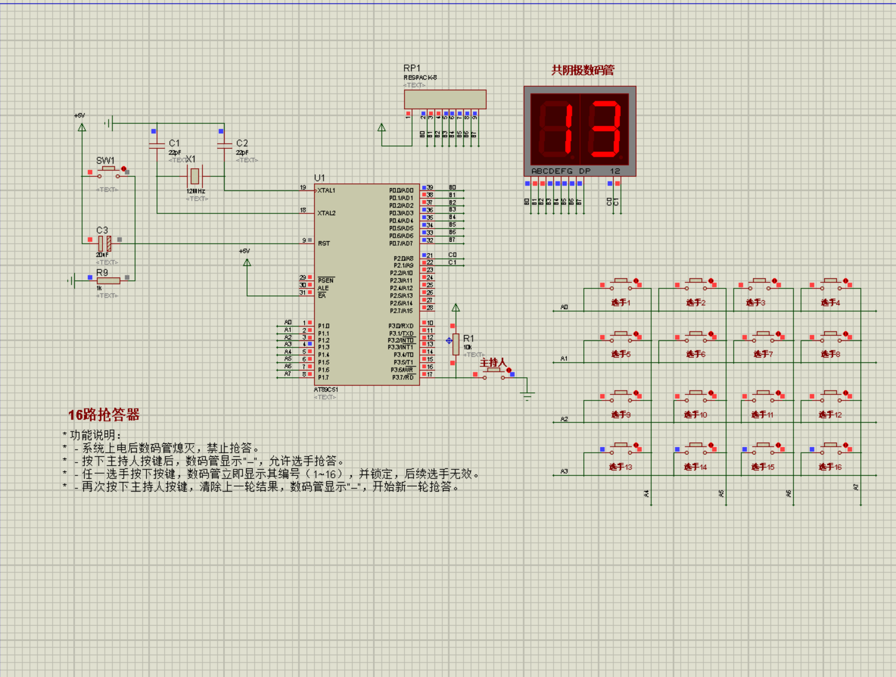
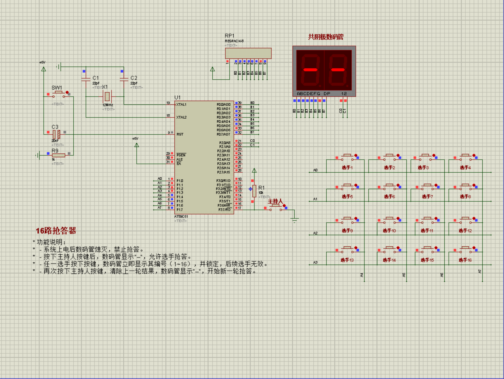
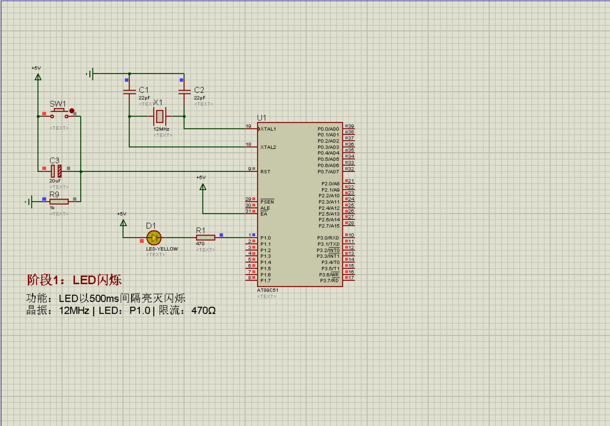
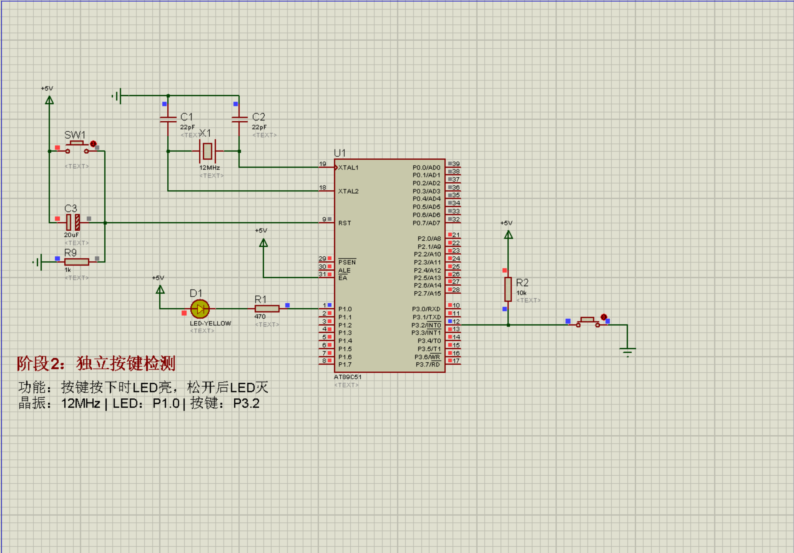
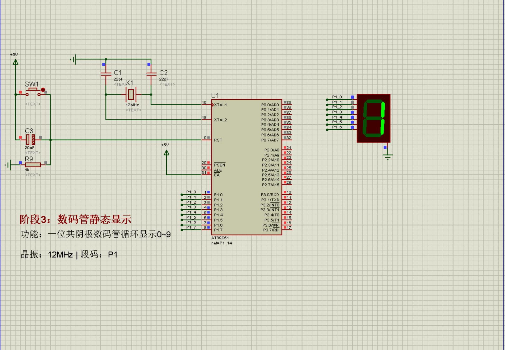
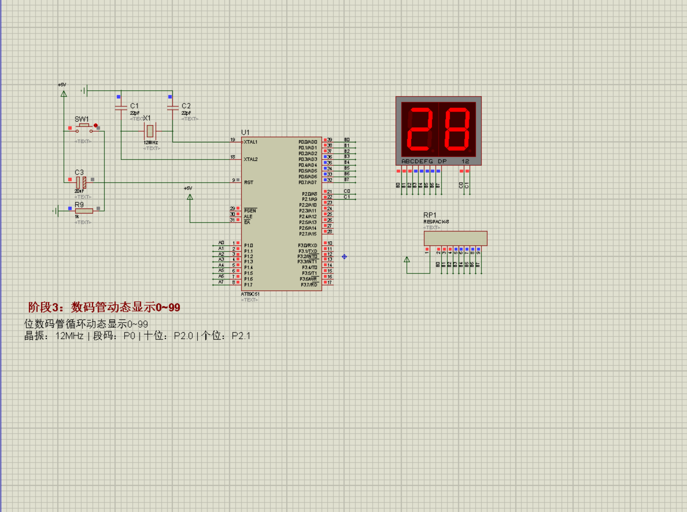
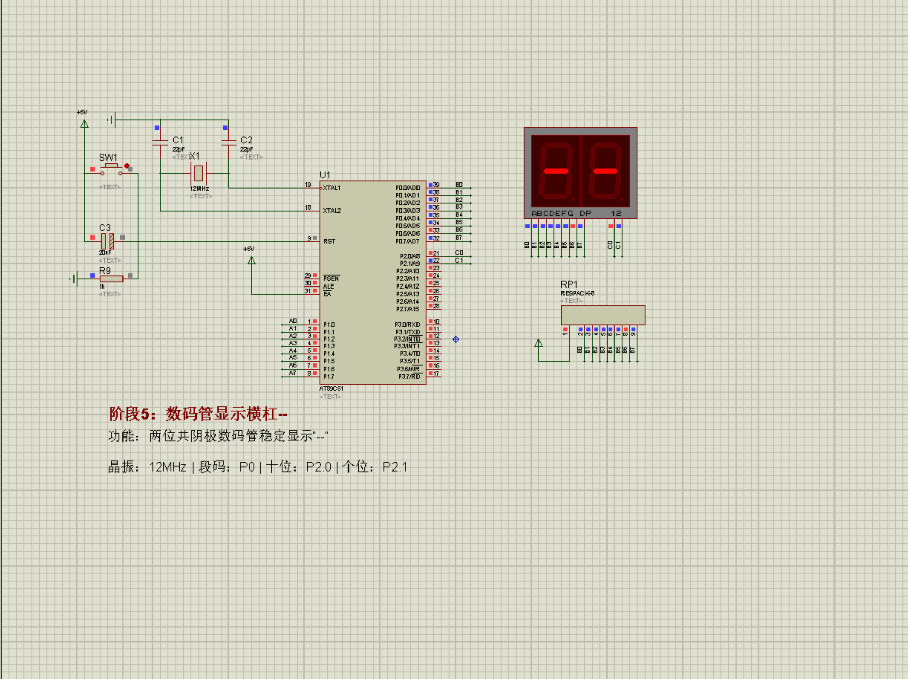
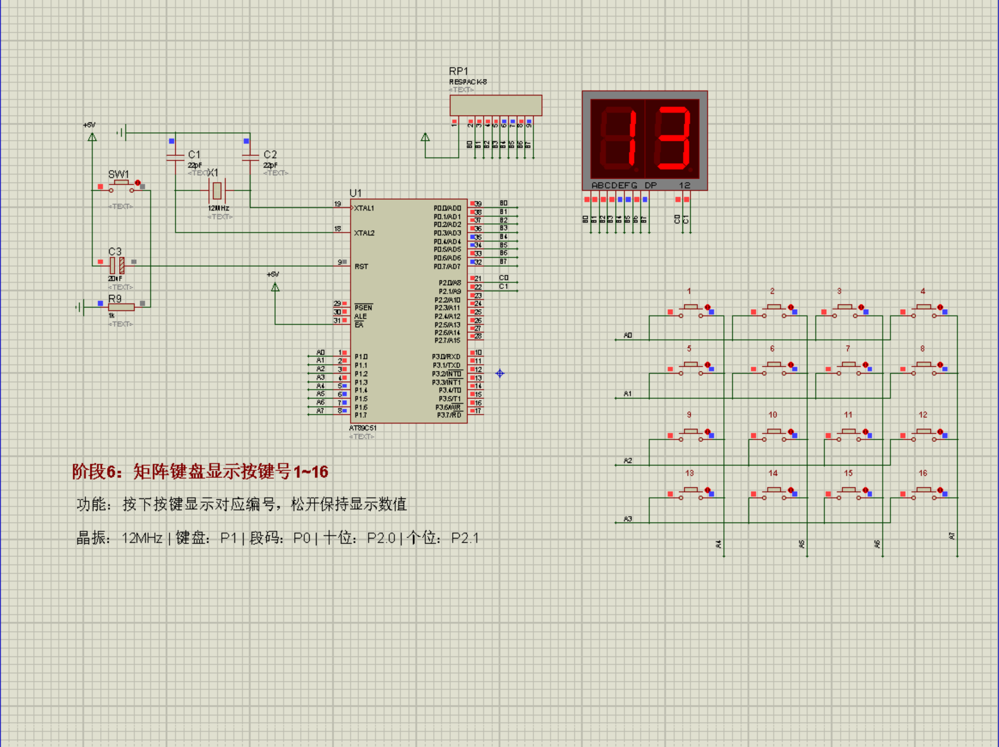

# 16路抢答器

> 用51单片机做的16路抢答器，含7步分阶段拆解

[← 返回C51](../../README.md) · [← 返回首页](../../../README.md)

---

## 元数据

| 项目 | 说明 |
| :--- | :--- |
| 芯片 | AT89C51 / STC89C52（Proteus 模型按工程内设置） |
| 工具链 | Keil uVision4（C51 / Keil4） |
| 仿真 | Proteus 7.8（仓库含 `.DSN`） |
| 晶振 | 12MHz（以原理图/工程为准） |
| 编码 | GBK / ANSI（`.c` 源码） |
| 验证状态 | **已仿真通过**（完整系统 + 7 个阶段均有截图） |
| 预期现象 | 待机显示 `--`；主持人复位后开放抢答；某路按下后锁定并显示编号 1~16，其余按键无效 |
| 工程文件 | 仓库只提供源码，请用 Keil4 新建工程后编译 |

---

## 完整系统预览

---

## 功能介绍

- 16路选手按键（4×4矩阵键盘）
- 主持人控制键（开始/复位）
- 两位数码管显示抢到的选手编号（1~16）
- 状态机设计：禁止→抢答→显示→复位

## 📌 分阶段拆解（推荐学习顺序）

这个项目最大的特点是**7步拆解**，从最简单的LED闪烁开始，一步步加功能，最终完成完整抢答器。

| 阶段 | 内容 | 你将学到 | 仿真截图 |
|:---|:---|:---|:---|
| [01-LED闪烁](./16路抢答器分阶段拆解/01-LED闪烁) | 点亮一个LED | Keil工程建立、P1口控制 |  |
| [02-独立按键检测](./16路抢答器分阶段拆解/02-独立按键检测) | 按键控制LED | 按键扫描原理、消抖 |  |
| [03-数码管静态显示0-9](./16路抢答器分阶段拆解/03-数码管静态显示0-9) | 数码管显示数字 | 段码表、P0口驱动 |  |
| [04-二位数码管显示0~99](./16路抢答器分阶段拆解/04-二位数码管显示0~99) | 两位数码管动态显示 | 动态扫描、位选控制 |  |
| [05-二位数码管显示两条杠](./16路抢答器分阶段拆解/05-二位数码管显示两条杠) | 显示"--"待机状态 | 自定义段码 |  |
| [06-4×4矩阵键盘](./16路抢答器分阶段拆解/06-二位数码管显示4X4矩阵数字/逐行反转法) | 矩阵键盘扫描 | 逐行反转法、行列扫描 |  |
| [07-状态机和完整程序](./16路抢答器分阶段拆解/07-状态机和完整程序) | 完整抢答器 | 状态机设计、中断配合 | 见上方完整系统预览 |

## 🔌 硬件需求

| 物料 | 数量 | 说明 |
|:---|:---|:---|
| 51单片机最小系统 | 1 | STC89C52 + 晶振 + 复位电路 |
| 4×4矩阵键盘 | 1 | 16路选手按键 |
| 独立按键 | 1 | 主持人控制键（P3.7） |
| 两位数码管 | 1 | 共阴极，显示选手编号 |
| 电阻 | 若干 | 上拉电阻、限流电阻 |
| Proteus | — | 仿真环境，无需实物 |

## 🛠️ 快速上手

> 请用源码在 Keil4 中新建工程后再编译。

### 仿真（推荐）

1. 用 Proteus 打开 [`16路抢答器/proteus/16路抢答器.DSN`](./16路抢答器/proteus/16路抢答器.DSN)  
2. 用 Keil4 **新建** C51 工程（芯片 AT89C51/STC89C52），把 [`16路抢答器/c/main.c`](./16路抢答器/c/main.c) 加入工程  
3. 编译生成 `.hex`  
4. 在 Proteus 中把 `.hex` 加载到单片机模型 → 运行仿真  
5. 按元数据表中的「预期现象」自测：复位后抢答、只认第一键、编号显示  

### 分阶段练习

按上表从 01 做到 07；每个阶段目录下都有对应的 `proteus/*.DSN` 与源码，可单独仿真。

## 💡 设计亮点

- **状态机设计**：禁止→抢答→显示→复位，逻辑清晰
- **首次按键有效**：只记录第一个按下的人，其他人按键无效
- **动态扫描显示**：两位数码管交替刷新，视觉无闪烁
- **非阻塞按键扫描**：配合主循环，不卡顿

## 📝 踩坑记录

**坑1：矩阵键盘有一行不响应**
→ 检查P1口的上拉电阻是否正确连接，P1口是准双向口，需要外部上拉

**坑2：数码管显示乱码**
→ 段码表数组下标越界，检查 seg_table[] 的索引范围

**坑3：抢答时有时识别不到按键**
→ 消抖延时太短或太长，10~20ms比较合适

## 📺 相关视频

> 视频制作中，完成后会更新链接。

---

[← 返回C51](../../README.md) · [← 返回首页](../../../README.md)
