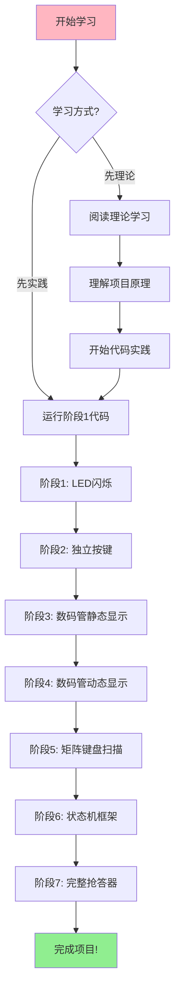
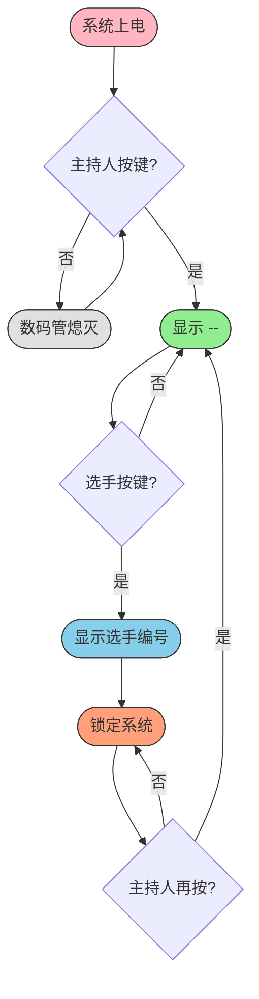
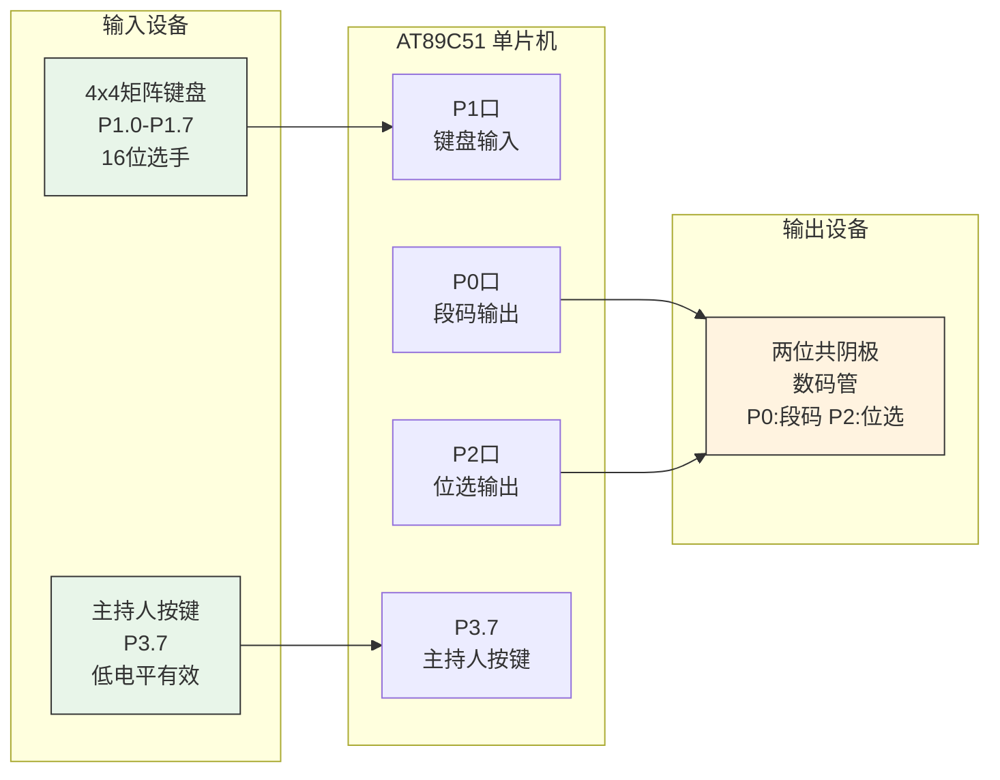
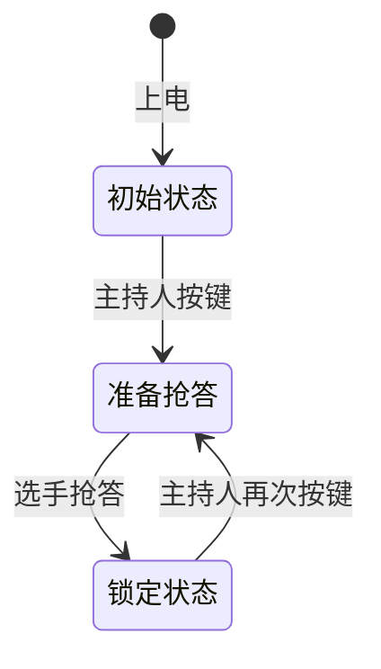

# 51单片机16路抢答器系统 - 完整学习指南 V4

> [!abstract] 关于本指南
> 本指南将抢答器项目的**理论学习**和**代码实践**整合在一起，适合新手从零开始系统学习。
> 
> **学习建议：** 先理解原理，再动手实践，遇到问题查阅调试技巧。

---

## 目录

### 第一部分：理论学习
- [[#第0章：前置知识准备]]
- [[#第一章：项目整体理解]]
- [[#第二章：代码逐行解析]]
- [[#第三章：新手常见错误]]
- [[#第四章：调试技巧]]
- [[#第五章：进阶思考]]
- [[#第六章：长期学习路径]]

### 第二部分：代码实践
- [[#阶段1：LED闪烁]] - IO口输出、延时函数
- [[#阶段2：独立按键检测]] - 输入检测、按键消抖
- [[#阶段3：数码管静态显示]] - 段码表、查表法
- [[#阶段4：数码管动态显示]] - 动态扫描、消隐
- [[#阶段5：矩阵键盘扫描]] - 行列扫描、键值计算
- [[#阶段6：状态机框架]] - 标志位、状态切换
- [[#阶段7：完整抢答器]] - 模块整合

### 附录
- [[#附录A：快速参考卡]]
- [[#附录B：参考链接与资源]]

---

## 学习路线总览



| 阶段  | 学习目标    | 核心知识点      | 预计时间 |
| --- | ------- | ---------- | ---- |
| 1   | LED闪烁   | IO口输出、延时函数 | 0.5天 |
| 2   | 独立按键    | 输入检测、按键消抖  | 0.5天 |
| 3   | 数码管静态显示 | 段码表、查表法    | 1天   |
| 4   | 数码管动态显示 | 动态扫描、消隐    | 1天   |
| 5   | 矩阵键盘扫描  | 行列扫描、键值计算  | 1.5天 |
| 6   | 状态机框架   | 标志位、状态切换   | 1天   |
| 7   | 完整抢答器   | 模块整合       | 1天   |

---

# 第一部分：理论学习

---

## 第0章：前置知识准备

### 0.1 什么是单片机？

单片机就是一台**超小型的电脑**，它把CPU、内存、输入输出接口都集成在一个芯片里。51单片机是最经典、最适合新手入门的型号。

```
+-------------------------------------+
|           单片机内部结构              |
+-------------------------------------+
|  +---------+    +---------------+   |
|  |   CPU   |--->|     RAM       |   | <- 临时存储数据
|  | (大脑)  |    |  (运行内存)    |   |
|  +----+----+    +---------------+   |
|       |                             |
|       v                             |
|  +---------+    +---------------+   |
|  |  ROM    |    |   定时器/中断  |   | <- 定时功能
|  | (程序)  |    |               |   |
|  +---------+    +---------------+   |
|                                     |
|  +-----------------------------+    |
|  |    I/O端口 (P0/P1/P2/P3)    |    | <- 连接外部设备
|  |      输入/输出接口           |    |
|  +-----------------------------+    |
+-------------------------------------+
```

### 0.2 需要掌握的基础知识

| 知识点 | 重要程度 | 说明 |
|--------|---------|------|
| C语言基础 | 必须掌握 | 变量、函数、if/else、for循环 |
| 二进制/十六进制 | 重要 | 0x3F表示什么？二进制位运算 |
| 基本电路概念 | 了解即可 | 高电平/低电平、上拉电阻 |
| 数码管原理 | 重要 | 共阴极/共阳极区别 |

> [!warning] 如果还不会C语言？
> 建议先花1-2天学习C语言基础，特别是：
> - 变量定义（int、char）
> - 函数定义和调用
> - if-else条件判断
> - for循环
> - 数组的使用

---

## ## 第一章：项目整体理解
**电路如下图所示，使用单片机设计一个十六路抢答器，具体要求如下：
系统上电后数码管处于灭的状态，当按下主持人按键时，数码管显示“--”，此时允许16位选手进行抢答，系统能够将最先抢答的选手号通过数码管显示（若13号选手按下选手按键，则数码管显示13），并锁定系统禁止其他选手抢答，当再次按下主持人按键时，系统清除前一次的选手号，数码管重新显示“--”，新一轮抢答开始。**

![[抢答器系统学习笔记-新手优化版-20260512232401966.png]]


### 1.1 抢答器是做什么的？

想象一个知识竞赛场景：
1. 主持人说"开始抢答",也就是按下按钮
2. 16位选手同时准备按按钮
3. 谁先按下，屏幕上就显示谁的编号
4. 其他人再按无效
5. 主持人重置，开始下一轮

这就是我们要做的抢答器！

### 1.2 系统工作流程图



**流程说明：**

| 状态 | 数码管显示 | 触发条件 |
|------|-----------|---------|
| 初始状态 | 熄灭 | 系统上电 |
| 准备状态 | -- | 主持人按键 |
| 锁定状态 | 选手号 | 选手抢答 |
| 重置 | -- | 主持人再次按键 |

### 1.3 硬件连接示意图，详细的链接方式在PPT配图中



**引脚分配表：**

| 引脚        | 功能             | 说明           |
| --------- | -------------- | ------------ |
| P0.0-P0.7 | 数码管段码（a-dp）    | 共阴极段码输出      |
| P2.0      | 十位位选（DIG_TEN）  | 低电平有效        |
| P2.1      | 个位位选（DIG_UNIT） | 低电平有效        |
| P1.0-P1.3 | 矩阵键盘行线         | 输出扫描信号       |
| P1.4-P1.7 | 矩阵键盘列线         | 输入检测信号       |
| P3.7      | 主持人按键          | 低电平有效，外接上拉电阻 |

---

## 第二章：代码逐行解析

### 2.1 头文件和类型定义

```c
#include <reg51.h>      // 包含51单片机寄存器定义
#define uint unsigned int   // 用uint代替unsigned int，省打字
#define uchar unsigned char // 用uchar代替unsigned char
```

> [!note] 什么是头文件？
> `reg51.h` 里面定义了P0、P1、P2、P3这些端口的地址，这样我们才能直接用P0、P1来操作硬件。

### 2.2 引脚定义详解

```c
sbit KEY_HOST = P3^7;    // 主持人按键接在P3口的第7脚
sbit DIG_TEN = P2^0;     // 十位数码管位选，接P2.0
sbit DIG_UNIT = P2^1;    // 个位数码管位选，接P2.1
```

> [!tip] sbit是什么意思？
> `sbit` 是定义**单个引脚**的关键字。`P3^7` 表示P3端口的第7位（从0开始数）。
> 
> 想象P3是一个8位的开关：`P3^7 P3^6 P3^5 P3^4 P3^3 P3^2 P3^1 P3^0`

### 2.3 数码管段码表（重点！）

```c
// 共阴极数码管段码表
uchar code seg_table[] = {
    0x3F,  // 0  二进制: 0011 1111
    0x06,  // 1  二进制: 0000 0110
    0x5B,  // 2  二进制: 0101 1011
    0x4F,  // 3  二进制: 0100 1111
    0x66,  // 4  二进制: 0110 0110
    0x6D,  // 5  二进制: 0110 1101
    0x7D,  // 6  二进制: 0111 1101
    0x07,  // 7  二进制: 0000 0111
    0x7F,  // 8  二进制: 0111 1111
    0x6F,  // 9  二进制: 0110 1111
    0x00,  // 索引10: 熄灭
    0x40   // 索引11: 横杠"-"
};
```

#### 段码是怎么算出来的？

数码管有8个段：a、b、c、d、e、f、g、dp（小数点）

```
     -- a --
    |       |
    f       b
    |       |
     -- g --
    |       |
    e       c
    |       |
     -- d --   (dp)
```

对应P0口的8个引脚：`P0.7 P0.6 P0.5 P0.4 P0.3 P0.2 P0.1 P0.0`
对应段的顺序：  `dp    g     f     e     d     c     b     a`

**以数字"0"为例**：
- 要点亮的段：a、b、c、d、e、f（除了g和dp）
- 二进制：0(dp) 0(g) 1(f) 1(e) 1(d) 1(c) 1(b) 1(a)
- 即：0011 1111 = 0x3F

### 2.4 延时函数

```c
void delay_ms(unsigned int ms)
{
    unsigned int i, j;
    for(i = ms; i > 0; i--)
        for(j = 120; j > 0; j--);  // 约1ms
}
```

> [!warning] 为什么是120？
> 这是根据12MHz晶振计算的经验值。`for(j=120; j>0; j--)` 大约执行1ms。
> 晶振频率不同，这个值要调整。

### 2.5 数码管显示函数（核心！）

```c
void display(unsigned char num)
{
    unsigned char ten, unit;
    
    // 第一步：确定要显示什么
    if(num == 17) {        // 特殊值17表示显示"--"
        ten = 11;          // 11对应段码表中的"-"
        unit = 11;
    }
    else if(num == 0) {    // 0表示熄灭
        ten = 10;          // 10对应段码表中的熄灭
        unit = 10;
    }
    else {                 // 显示1-16的数字
        ten = num / 10;    // 十位（如13/10=1）
        unit = num % 10;   // 个位（如13%10=3）
        if(ten == 0) ten = 10;  // 十位为0时不显示,对应段码表的索引10
    }
    
    // 第二步：动态扫描显示
    // 【关键】先消隐，防止残影！
    P0 = 0x00;          // 段码全部置0
    DIG_TEN = 1;        // 关闭十位
    DIG_UNIT = 1;       // 关闭个位
    
    // 显示十位
    P0 = seg_table[ten];    // 输出十位段码
    DIG_TEN = 0;            // 选通十位（低电平有效）
    delay_ms(1);            // 延时1ms让人眼看到
    DIG_TEN = 1;            // 关闭十位
    
    // 显示个位
    P0 = seg_table[unit];   // 输出个位段码
    DIG_UNIT = 0;           // 选通个位
    delay_ms(1);            // 延时
    DIG_UNIT = 1;           // 关闭个位
}
```

#### 动态扫描原理

```
时间轴 -->

时刻1:  [十位亮: "1"]  [个位灭]     显示"1"
时刻2:  [十位灭]  [个位亮: "3"]     显示"3"
...快速循环(500Hz)...

人眼看到: "13" （视觉暂留，看起来两个都亮）
```

> [!tip] 为什么要消隐？
> 如果不先`P0=0x00`，切换位选时，段码还是上一个数字的，会造成"鬼影"。

### 2.6 矩阵键盘扫描（难点！）

#### 矩阵键盘结构

```
        列0(P1.4)   列1(P1.5)   列2(P1.6)   列3(P1.7)
           |          |          |          |
行0(P1.0)--+----1-----+----2-----+----3-----+----4-----
           |          |          |          |
行1(P1.1)--+----5-----+----6-----+----7-----+----8-----
           |          |          |          |
行2(P1.2)--+----9-----+---10-----+---11-----+---12-----
           |          |          |          |
行3(P1.3)--+---13-----+---14-----+---15-----+---16-----
           |          |          |          |
```

#### 扫描原理

```c
uchar key_scan(void)
{
    uchar row, col, key_val;
    
    // 步骤1：检测是否有按键按下
    P1 = 0x0F;  // 0000 1111：行线输出0，列线输入1
    
    if((P1 & 0xF0) != 0xF0)  // 高4位有变化
    {
        delay_ms(10);  // 消抖
        
        if((P1 & 0xF0) != 0xF0)  // 确认有按键
        {
            // 步骤2：逐行扫描
            for(row = 0; row < 4; row++)
            {
                P1 = 0xF0 | ~(1 << row);
                
                if((P1 & 0xF0) != 0xF0)
                {
                    // 步骤3：确定列号
                    col = (P1 & 0xF0) >> 4;
                    switch(col)
                    {
                        case 0x0E: col = 0; break;
                        case 0x0D: col = 1; break;
                        case 0x0B: col = 2; break;
                        case 0x07: col = 3; break;
                    }
                    
                    // 步骤4：计算按键编号
                    key_val = row * 4 + col + 1;
                    
                    // 等待按键释放
                    while((P1 & 0xF0) != 0xF0);
                    delay_ms(10);
                    
                    return key_val;
                }
            }
        }
    }
    return 0;
}
```

### 2.7 主函数状态机

```c
void main(void)
{
    // 初始化
    P0 = 0x00; P1 = 0xFF; P2 = 0xFF; P3 = 0xFF;
    
    while(1)
    {
        // 检测主持人按键
        if(KEY_HOST == 0)
        {
            delay_ms(10);
            if(KEY_HOST == 0)
            {
                allow_answer = 1;
                key_num = 0;
                while(KEY_HOST == 0);
            }
        }
        
        // 状态机
        if(allow_answer == 0)
            display(0);           // 初始状态：熄灭
        else if(key_num == 0)
        {
            display(17);           // 准备状态：显示"--"
            key_num = key_scan();
        }
        else
            display(key_num);      // 锁定状态：显示选手号
    }
}
```

#### 状态转换图



---

## 第三章：新手常见错误

### 3.1 代码错误

| 错误 | 现象 | 原因 | 解决 |
|------|------|------|------|
| 数码管不亮 | 完全不显示 | 位选/段码接反 | 检查P0、P2接线 |
| 数码管乱闪 | 显示混乱 | 没消隐 | 切换前加`P0=0x00` |
| 键盘无响应 | 按了没反应 | 行列定义反了 | 检查P1口接线 |
| 抢答不锁定 | 后按的覆盖先按的 | 没判断key_num | 确保抢答后不再扫描 |
| 显示"8" | 所有段都亮 | 位选一直低电平 | 检查位选控制逻辑 |

### 3.2 硬件错误

> [!danger] 常见硬件问题
> 1. **数码管共阴/共阳搞错** -> 显示反了
> 2. **按键没接上拉电阻** -> 按键不稳定
> 3. **晶振没接或接错** -> 程序不运行
> 4. **复位电路有问题** -> 程序跑飞

---

## 第四章：调试技巧

### 4.1 分模块测试

```
步骤1: 只测试数码管显示 -> 确认能显示0-9
步骤2: 只测试延时函数   -> 确认延时准确
步骤3: 只测试键盘扫描   -> 用LED输出键值
步骤4: 整合测试         -> 完整功能
```

### 4.2 使用LED调试

```c
P0 = key_num;  // 直接输出键值到LED
```

### 4.3 串口打印调试

```c
void UART_Init() {
    SCON = 0x50; TMOD = 0x20;
    TH1 = 0xFD; TL1 = 0xFD; TR1 = 1;
}

printf("key_num = %d\r\n", key_num);
```

---

## 第五章：进阶思考

### 5.1 知识点延伸

```
抢答器项目
    +-- 数码管显示（静态/动态）
    +-- 键盘输入（独立/矩阵）
    +-- 状态管理（标志位/状态机）
    +-- 延时处理（软件/定时器）
```

### 5.2 改进方向（暂不做考虑，只是发散思维应该无处不在）

1. **加入定时器中断** - 更精确的控制
2. **加入蜂鸣器** - 抢答成功提示
3. **加入倒计时** - 限时抢答
4. **EEPROM存储** - 记录抢答结果
5. **串口通信** - 连接电脑

---

## 第六章：长期学习路径

### 6.1 学习路线图


### 6.2 推荐学习资源

#### 视频教程
| 资源名称 | 平台 | 特点 |
|---------|------|------|
| 郭天祥51单片机教程 | B站 | 经典入门，讲解详细 |
| 正点原子51单片机 | B站 | 配套开发板，资料齐全 |

#### 书籍推荐
- 《新概念51单片机C语言教程》- 郭天祥
- 《51单片机C语言程序设计》- 宋雪松

#### 开发工具
| 工具 | 用途 |
|------|------|
| Keil uVision5 | 编程、编译、调试 |
| Proteus 8 | 电路仿真 |
| STC-ISP | 程序下载 |

---

# 第二部分：代码实践

---

## 阶段1：LED闪烁

### 学习目标
- 掌握IO口基本操作
- 理解延时函数原理
- 学会使用sbit定义引脚

### 硬件连接
```
P1.0 ----[220欧]----[LED]---- GND
```

### 完整代码

```c
/*********************************************
 * 阶段1：LED闪烁
 * 功能：LED以500ms间隔闪烁
 *********************************************/

#include <reg51.h>

sbit LED = P1^0;      // 定义LED接在P1.0

void delay_ms(unsigned int ms)
{
    unsigned int i, j;
    for(i = ms; i > 0; i--)
        for(j = 120; j > 0; j--);
}

void main(void)
{
    while(1)
    {
        LED = 0;       // LED亮
        delay_ms(500);
        LED = 1;       // LED灭
        delay_ms(500);
    }
}
```

### 常见问题

> [!question] LED不亮？
> 1. 检查LED极性（长脚为正极）
> 2. 检查电阻是否正确（220欧-1K欧）
> 3. 确认是共阴LED（低电平亮）还是共阳LED（高电平亮）

### 进阶挑战
- [ ] 实现LED快闪3次后慢闪1次
- [ ] 使用P1口的8个LED实现流水灯效果

---

## 阶段2：独立按键检测

### 学习目标
- 掌握IO口输入操作
- 理解按键消抖原理

### 硬件连接
```
         VCC
          |
        [10K] 上拉电阻
          |
P3.2 -----+----[按键]---- GND
```

### 完整代码

```c
/*********************************************
 * 阶段2：独立按键检测
 * 功能：按键按下LED亮，松开LED灭
 *********************************************/

#include <reg51.h>

sbit LED = P1^0;
sbit KEY = P3^2;

void delay_ms(unsigned int ms)
{
    unsigned int i, j;
    for(i = ms; i > 0; i--)
        for(j = 120; j > 0; j--);
}

void main(void)
{
    LED = 1;  // LED初始灭
    
    while(1)
    {
        if(KEY == 0)  // 检测按键按下
        {
            delay_ms(10);  // 消抖
            if(KEY == 0)
            {
                LED = 0;   // LED亮
                while(KEY == 0);  // 等待释放
                delay_ms(10);
                LED = 1;   // LED灭
            }
        }
    }
}
```

### 按键消抖原理

```
按键按下时的实际波形：
    ___     _ _ _ _ _     ___________
       |   |           |   |
       |   |   抖动    |   |
_______|___|___________|___|___________
        10-20ms抖动

消抖方法：延时10-20ms后再次检测
```

### 进阶挑战
- [ ] 实现按键按下LED翻转
- [ ] 实现长按和短按区分

---

## 阶段3：数码管静态显示

### 学习目标
- 理解数码管段码原理
- 学会使用数组查表

### 硬件连接
```
P0.0-P0.7 ---- 数码管段码(a-dp)
数码管公共端 ---- GND（共阴极）
```

### 完整代码

```c
/*********************************************
 * 阶段3：数码管静态显示
 * 功能：显示数字0-9循环
 *********************************************/

#include <reg51.h>

unsigned char code seg_table[] = {
    0x3F, 0x06, 0x5B, 0x4F, 0x66,
    0x6D, 0x7D, 0x07, 0x7F, 0x6F
};

void delay_ms(unsigned int ms)
{
    unsigned int i, j;
    for(i = ms; i > 0; i--)
        for(j = 120; j > 0; j--);
}

void main(void)
{
    unsigned char i;
    
    while(1)
    {
        for(i = 0; i < 10; i++)
        {
            P0 = seg_table[i];
            delay_ms(500);
        }
    }
}
```

### 段码速查表

| 数字 | 共阴极 | 共阳极 | 点亮的段 |
|------|--------|--------|---------|
| 0 | 0x3F | 0xC0 | a,b,c,d,e,f |
| 1 | 0x06 | 0xF9 | b,c |
| 2 | 0x5B | 0xA4 | a,b,d,e,g |
| 3 | 0x4F | 0xB0 | a,b,c,d,g |
| 4 | 0x66 | 0x99 | b,c,f,g |
| 5 | 0x6D | 0x92 | a,c,d,f,g |
| 6 | 0x7D | 0x82 | a,c,d,e,f,g |
| 7 | 0x07 | 0xF8 | a,b,c |
| 8 | 0x7F | 0x80 | a,b,c,d,e,f,g |
| 9 | 0x6F | 0x90 | a,b,c,d,f,g |

---

## 阶段4：数码管动态显示

### 学习目标
- 理解动态扫描原理
- 掌握消隐技术

### 硬件连接
```
P0口 ---- 段码（a-dp）
P2.0 ---- 十位位选（低电平有效）
P2.1 ---- 个位位选（低电平有效）
```

### 完整代码

```c
/*********************************************
 * 阶段4：数码管动态显示
 * 功能：两位数码管显示00-99循环
 *********************************************/

#include <reg51.h>

sbit DIG_TEN  = P2^0;
sbit DIG_UNIT = P2^1;

unsigned char code seg_table[] = {
    0x3F, 0x06, 0x5B, 0x4F, 0x66,
    0x6D, 0x7D, 0x07, 0x7F, 0x6F,
    0x00  // 10: 熄灭
};

void delay_ms(unsigned int ms)
{
    unsigned int i, j;
    for(i = ms; i > 0; i--)
        for(j = 120; j > 0; j--);
}

void display(unsigned char num)
{
    unsigned char ten, unit;
    
    ten = num / 10;
    unit = num % 10;
    
    // 显示十位
    P0 = 0x00;              // 消隐
    DIG_TEN = 1; DIG_UNIT = 1;
    P0 = seg_table[ten];
    DIG_TEN = 0;
    //时间太短无法看清数字的变化
    delay_ms(25);
    DIG_TEN = 1;
    
    // 显示个位
    P0 = 0x00;
    DIG_TEN = 1; DIG_UNIT = 1;
    P0 = seg_table[unit];
    DIG_UNIT = 0;
    delay_ms(25);
    DIG_UNIT = 1;
}

void main(void)
{
    unsigned char num = 0;
    unsigned int count;
    
    while(1)
    {
        for(count = 0; count < 250; count++)
            display(num);
        
        num++;
        if(num > 99) num = 0;
    }
}
```

### 动态扫描原理

```
时刻1:  十位亮 "1"  个位灭      显示 "1"
时刻2:  十位灭      个位亮 "3"  显示 "3"
...快速循环(约500Hz)...

人眼看到: "13" （视觉暂留效果）
```

---

## 阶段5：矩阵键盘扫描

### 学习目标
- 理解矩阵键盘结构
- 掌握行列扫描方法

### 硬件连接

```
        列0(P1.4)   列1(P1.5)   列2(P1.6)   列3(P1.7)
           |          |          |          |
行0(P1.0)--+----1-----+----2-----+----3-----+----4-----
           |          |          |          |
行1(P1.1)--+----5-----+----6-----+----7-----+----8-----
           |          |          |          |
行2(P1.2)--+----9-----+---10-----+---11-----+---12-----
           |          |          |          |
行3(P1.3)--+---13-----+---14-----+---15-----+---16-----
```

### 完整代码

```c
/*********************************************
 * 阶段5：矩阵键盘扫描
 * 功能：按下按键显示对应编号(1-16)
 *********************************************/

#include <reg51.h>

sbit DIG_TEN  = P2^0;
sbit DIG_UNIT = P2^1;

unsigned char code seg_table[] = {
    0x3F, 0x06, 0x5B, 0x4F, 0x66,
    0x6D, 0x7D, 0x07, 0x7F, 0x6F,
    0x00, 0x40
};

void delay_ms(unsigned int ms)
{
    unsigned int i, j;
    for(i = ms; i > 0; i--)
        for(j = 120; j > 0; j--);
}

void display(unsigned char num)
{
    unsigned char ten, unit;
    
    if(num == 0) { ten = 10; unit = 10; }
    else {
        ten = num / 10;
        unit = num % 10;
        if(ten == 0) ten = 10;
    }
    
    P0 = 0x00; DIG_TEN = 1; DIG_UNIT = 1;
    P0 = seg_table[ten]; DIG_TEN = 0; delay_ms(1); DIG_TEN = 1;
    P0 = 0x00; DIG_TEN = 1; DIG_UNIT = 1;
    P0 = seg_table[unit]; DIG_UNIT = 0; delay_ms(1); DIG_UNIT = 1;
}

unsigned char key_scan(void)
{
    unsigned char row, col, key_val;
    
    P1 = 0x0F;
    if((P1 & 0xF0) != 0xF0)
    {
        delay_ms(10);
        if((P1 & 0xF0) != 0xF0)
        {
            for(row = 0; row < 4; row++)
            {
                P1 = 0xF0 | ~(1 << row);
                if((P1 & 0xF0) != 0xF0)
                {
                    col = (P1 & 0xF0) >> 4;
                    switch(col) {
                        case 0x0E: col = 0; break;
                        case 0x0D: col = 1; break;
                        case 0x0B: col = 2; break;
                        case 0x07: col = 3; break;
                    }
                    key_val = row * 4 + col + 1;
                    while((P1 & 0xF0) != 0xF0);
                    delay_ms(10);
                    return key_val;
                }
            }
        }
    }
    return 0;
}

void main(void)
{
    unsigned char key_num = 0;
    
    while(1)
    {
        key_num = key_scan();
        display(key_num);
    }
}
```

---

## 阶段6：状态机框架

### 学习目标
- 理解状态机概念
- 学会使用标志位

### 完整代码

```c
/*********************************************
 * 阶段6：状态机框架
 * 功能：演示三种状态的切换
 *********************************************/

#include <reg51.h>

sbit KEY_HOST = P3^7;
sbit DIG_TEN  = P2^0;
sbit DIG_UNIT = P2^1;

unsigned char code seg_table[] = {
    0x3F, 0x06, 0x5B, 0x4F, 0x66,
    0x6D, 0x7D, 0x07, 0x7F, 0x6F,
    0x00, 0x40
};

unsigned char key_num = 0;
bit allow_answer = 0;

void delay_ms(unsigned int ms)
{
    unsigned int i, j;
    for(i = ms; i > 0; i--)
        for(j = 120; j > 0; j--);
}

void display(unsigned char num)
{
    unsigned char ten, unit;
    
    if(num == 0) { ten = 10; unit = 10; }
    else if(num == 17) { ten = 11; unit = 11; }
    else {
        ten = num / 10; unit = num % 10;
        if(ten == 0) ten = 10;
    }
    
    P0 = 0x00; DIG_TEN = 1; DIG_UNIT = 1;
    P0 = seg_table[ten]; DIG_TEN = 0; delay_ms(1); DIG_TEN = 1;
    P0 = 0x00; DIG_TEN = 1; DIG_UNIT = 1;
    P0 = seg_table[unit]; DIG_UNIT = 0; delay_ms(1); DIG_UNIT = 1;
}

unsigned char key_scan(void)
{
    unsigned char row, col, key_val;
    
    P1 = 0x0F;
    if((P1 & 0xF0) != 0xF0) {
        delay_ms(10);
        if((P1 & 0xF0) != 0xF0) {
            for(row = 0; row < 4; row++) {
                P1 = 0xF0 | ~(1 << row);
                if((P1 & 0xF0) != 0xF0) {
                    col = (P1 & 0xF0) >> 4;
                    switch(col) {
                        case 0x0E: col = 0; break;
                        case 0x0D: col = 1; break;
                        case 0x0B: col = 2; break;
                        case 0x07: col = 3; break;
                    }
                    key_val = row * 4 + col + 1;
                    while((P1 & 0xF0) != 0xF0);
                    delay_ms(10);
                    return key_val;
                }
            }
        }
    }
    return 0;
}

void main(void)
{
    P0 = 0x00; P1 = 0xFF; P2 = 0xFF; P3 = 0xFF;
    
    while(1)
    {
        if(KEY_HOST == 0) {
            delay_ms(10);
            if(KEY_HOST == 0) {
                allow_answer = 1;
                key_num = 0;
                while(KEY_HOST == 0);
            }
        }
        
        if(allow_answer == 0)
            display(0);
        else if(key_num == 0) {
            display(17);
            key_num = key_scan();
        }
        else
            display(key_num);
    }
}
```

---

## 阶段7：完整抢答器

### 功能需求

| 状态 | 数码管显示 | 触发条件 |
|------|-----------|---------|
| 初始状态 | 熄灭 | 系统上电 |
| 准备状态 | -- | 主持人按键 |
| 抢答状态 | 选手号 | 选手按键 |
| 锁定状态 | 选手号 | 自动锁定 |
| 重置状态 | -- | 主持人再次按键 |

### 完整代码

```c
/*********************************************
 * 阶段7：完整抢答器
 * 功能：16路抢答器，支持锁定和重置
 *********************************************/

#include <reg51.h>

/* 引脚定义 */
sbit KEY_HOST = P3^7;
sbit DIG_TEN  = P2^0;
sbit DIG_UNIT = P2^1;

/* 段码表 */
unsigned char code seg_table[] = {
    0x3F, 0x06, 0x5B, 0x4F, 0x66,
    0x6D, 0x7D, 0x07, 0x7F, 0x6F,
    0x00, 0x40
};

/* 全局变量 */
unsigned char key_num = 0;
bit allow_answer = 0;

void delay_ms(unsigned int ms)
{
    unsigned int i, j;
    for(i = ms; i > 0; i--)
        for(j = 120; j > 0; j--);
}

void display(unsigned char num)
{
    unsigned char ten, unit;
    
    if(num == 17) { ten = 11; unit = 11; }
    else if(num == 0) { ten = 10; unit = 10; }
    else {
        ten = num / 10; unit = num % 10;
        if(ten == 0) ten = 10;
    }
    
    P0 = 0x00; DIG_TEN = 1; DIG_UNIT = 1;
    P0 = seg_table[ten]; DIG_TEN = 0; delay_ms(1); DIG_TEN = 1;
    P0 = 0x00; DIG_TEN = 1; DIG_UNIT = 1;
    P0 = seg_table[unit]; DIG_UNIT = 0; delay_ms(1); DIG_UNIT = 1;
}

unsigned char key_scan(void)
{
    unsigned char row, col, key_val;
    
    P1 = 0x0F;
    if((P1 & 0xF0) != 0xF0) {
        delay_ms(10);
        if((P1 & 0xF0) != 0xF0) {
            for(row = 0; row < 4; row++) {
                P1 = 0xF0 | ~(1 << row);
                if((P1 & 0xF0) != 0xF0) {
                    col = (P1 & 0xF0) >> 4;
                    switch(col) {
                        case 0x0E: col = 0; break;
                        case 0x0D: col = 1; break;
                        case 0x0B: col = 2; break;
                        case 0x07: col = 3; break;
                    }
                    key_val = row * 4 + col + 1;
                    while((P1 & 0xF0) != 0xF0);
                    delay_ms(10);
                    return key_val;
                }
            }
        }
    }
    return 0;
}

void main(void)
{
    P0 = 0x00; P1 = 0xFF; P2 = 0xFF; P3 = 0xFF;
    
    while(1)
    {
        if(KEY_HOST == 0) {
            delay_ms(10);
            if(KEY_HOST == 0) {
                allow_answer = 1;
                key_num = 0;
                while(KEY_HOST == 0);
            }
        }
        
        if(allow_answer == 0)
            display(0);
        else if(key_num == 0) {
            display(17);
            key_num = key_scan();
        }
        else
            display(key_num);
    }
}
```

### 功能验证清单

- [ ] 上电后数码管熄灭
- [ ] 按主持人键后显示"--"
- [ ] 按选手键后显示对应编号
- [ ] 抢答后其他选手按键无效
- [ ] 再次按主持人键重置为"--"

---

# 附录

---

## 附录A：快速参考卡

### A.1 常用段码表

| 字符 | 共阴极 | 共阳极 |
|------|--------|--------|
| 0 | 0x3F | 0xC0 |
| 1 | 0x06 | 0xF9 |
| 2 | 0x5B | 0xA4 |
| 3 | 0x4F | 0xB0 |
| 4 | 0x66 | 0x99 |
| 5 | 0x6D | 0x92 |
| 6 | 0x7D | 0x82 |
| 7 | 0x07 | 0xF8 |
| 8 | 0x7F | 0x80 |
| 9 | 0x6F | 0x90 |
| - | 0x40 | 0xBF |
| 灭 | 0x00 | 0xFF |

### A.2 位操作速查

```c
// 置1（不影响其他位）
P1 |= (1 << n);

// 清0（不影响其他位）
P1 &= ~(1 << n);

// 取反（不影响其他位）
P1 ^= (1 << n);

// 读取某一位
bit_value = (P1 >> n) & 1;

// 读取高4位
high = (P1 & 0xF0) >> 4;

// 读取低4位
low = P1 & 0x0F;
```

### A.3 51单片机特殊功能寄存器

| 寄存器 | 地址 | 功能 |
|--------|------|------|
| P0 | 0x80 | 端口0 |
| P1 | 0x90 | 端口1 |
| P2 | 0xA0 | 端口2 |
| P3 | 0xB0 | 端口3 |
| TCON | 0x88 | 定时器控制 |
| TMOD | 0x89 | 定时器模式 |
| SCON | 0x98 | 串口控制 |
| IE | 0xA8 | 中断使能 |

---

## 附录B：参考链接与资源

### 在线学习资源

#### 视频教程
- [郭天祥51单片机教程 - B站](https://www.bilibili.com)
- [正点原子51单片机 - B站](https://www.bilibili.com)
- [普中科技51教程 - B站](https://www.bilibili.com)

#### 技术文档
- [51单片机入门自学 - 电子发烧友](https://m.elecfans.com/zt/61784/)
- [CSDN 51单片机教程](https://blog.csdn.net)


### 开发工具下载

| 工具 | 下载地址 |
|------|---------|
| Keil uVision5 | https://www.keil.com/download |
| Proteus 8 | https://www.labcenter.com |
| STC-ISP | http://www.stcmcudata.com |

---

> [!success] 给新手的鼓励
> 学习单片机最重要的是**动手实践**。不要只看不动，遇到问题多查资料、多尝试。每个专家都是从点亮第一个LED开始的！
> 
> 这个项目涵盖了数码管显示、键盘输入、状态管理等多个核心知识点，完成后你已经具备了扎实的单片机基础。继续加油！

---

*最后更新: 2026-05-12*
*版本: V4.0 完整整合版*
*标签: #新手教程 #51单片机 #抢答器 #完整指南*