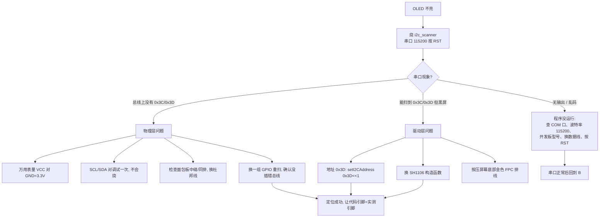

# ESP32-S3 + 0.96″ OLED 完整教学文档

> 平台：正点原子 DNESP32S3（模组 ATK-DMWSP3S / ESP32-S3 N16R8）
> 屏幕：0.96 寸 I2C OLED，SSD1306，128×64，地址 0x3C
> 框架：Arduino IDE + U8g2 图形库
> 文档定位：从接线、点亮、原理到排障、进阶的**可复现**教程。所有引脚结论均经过总线扫描实测，不是想当然。

---

## 目录

1. [项目概览与硬件清单](#1-项目概览与硬件清单)
2. [认识硬件](#2-认识硬件)
3. [开发环境搭建](#3-开发环境搭建)
4. [接线](#4-接线)
5. [第一个程序：点亮屏幕（逐行讲解）](#5-第一个程序点亮屏幕逐行讲解)
6. [核心原理](#6-核心原理)
7. [排障方法论（实战复盘）](#7-排障方法论实战复盘)
8. [进阶案例](#8-进阶案例)
9. [附录](#9-附录)

---

## 1. 项目概览与硬件清单

### 1.1 最终成果

ESP32-S3 通过 4 根杜邦线驱动 0.96 寸 OLED，屏幕显示标题、运行时间、计数器和走动的进度条，并为后续"传感器上屏 / 网络时钟 / 物联网看板"打下显示底座。

### 1.2 硬件清单

| 物料 | 型号/规格 | 说明 |
|---|---|---|
| 开发板 | 正点原子 DNESP32S3 | 板载 WiFi/蓝牙，双 USB，资源丰富 |
| 显示屏 | 0.96″ OLED 模块 | 4 针 I2C：GND/VCC/SCL/SDA，SSD1306，128×64 |
| 杜邦线 | 公对公 ×4 | 经面包板连接 |
| 面包板 | 通用 | 注意中缝两侧不连通 |
| 数据线 | USB 转 Type-C/Micro | **必须是数据线**，纯充电线无法上传 |

### 1.3 最终接线结论（先记住，后面解释为什么）

| OLED | 开发板排针丝印 | 实际 GPIO |
|---|---|---|
| GND | GND | — |
| VCC | **3V3**（3.3V，不要接 5V） | — |
| SCL | 底部排针 **SCL** | **GPIO38** |
| SDA | 底部排针 **SDA** | **GPIO39** |

> ⚠️ 这是本项目最容易踩的坑，也是本文档最重要的结论：**这块底板底部丝印 SCL/SDA 的排针，实际对应 GPIO38/39（摄像头扩展总线），而不是板载主 I2C 的 GPIO42/41。** 详见 [2.3 节](#23-关键底板上的两组-i2c)。

---

## 2. 认识硬件

### 2.1 开发板 DNESP32S3

几个和本项目相关的区域：

- **左侧两个 USB 口**
  - 标 **UART** 的口：经板载 CH340 转串口，**新手上传一律用它**，自带自动下载电路，最省心。
  - 标 **USB** 的口：直连 ESP32-S3 原生 USB（GPIO19/20），进阶才用。
- **底部两排黄色排针**：引出摄像头 DVP 信号与部分通用 IO，丝印包含 `GND SCL SDA IO0 IO2 IO4 D6 CLK PMD … 3V3 VS HR RST IO1 IO45`。
- **右侧 VOUT1**：3.3V/GND 电源输出针，也可取电。
- **板载 I2C 器件**（在主板内部，无需接线即可扫描到）：光感 AP3216C、IO 扩展 XL9555、EEPROM 24C02 等。

### 2.2 OLED 模块（SSD1306）

- **分辨率**：128×64，单色（白/蓝/黄蓝双色取决于具体屏幕）。
- **接口**：4 针 I2C，只需要两根信号线（SCL 时钟、SDA 数据）。
- **从机地址**：绝大多数是 `0x3C`，少数模块焊接地址电阻后是 `0x3D`。
- **供电**：模块一般支持 3.3~5V，但 ESP32-S3 的 IO **不是 5V 容忍**的，统一用 **3.3V** 最安全。
- **自发光**：OLED 没有背光，通电后像素自己发光，黑色就是不亮。

### 2.3 关键：底板上的两组 I2C

这块板上存在**两组物理 I2C**，名字都带 "SCL/SDA"，极易混淆：

| 总线 | GPIO | 物理位置 | 挂了什么 |
|---|---|---|---|
| **外部扩展总线** | SCL=**38** / SDA=**39** | 底部黄色排针，丝印 SCL/SDA（旁边是 D6/CLK/VS/HR 等摄像头信号） | 空的，留给你外接设备 → **OLED 接这里** |
| **板载主总线** | SCL=**42** / SDA=**41** | 芯片内部，未引到上述排针 | 24C02、XL9555、AP3216C |

**怎么判断的？** 两条证据互相印证：

1. 排针丝印 `D6 / CLK(PCLK) / VS(VSYNC) / HR(HREF)` 全是摄像头 DVP 信号名，而正点原子摄像头 SCCB（兼容 I2C）官方定义就是 `SCL=38 / SDA=39`。
2. 用总线扫描程序实测：OLED 插在丝印 SCL/SDA 上时，只有扫描 38/39 能应答 `0x3C`；扫描 41/42 只能看到板载芯片。

> 经验教训（非常重要）：**丝印名字不等于 GPIO 编号，通信总线上"扫得到谁"才是事实。** 学嵌入式要相信仪器和实测，敢于质疑想当然的推断。

---

## 3. 开发环境搭建

### 3.1 安装 Arduino IDE

到 arduino.cc 下载安装 2.x 版本，全程默认。

### 3.2 添加 ESP32 板卡支持

1. 菜单 **文件 → 首选项**；
2. 在"附加开发板管理器网址"填入：

```text
https://espressif.github.io/arduino-esp32/package_esp32_index.json
```

3. 菜单 **工具 → 开发板 → 开发板管理器**，搜索 `esp32`，安装 **esp32 by Espressif Systems**（体积较大，耐心等）。

### 3.3 安装 U8g2 图形库

菜单 **工具 → 管理库**，搜索 `U8g2`（作者 oliver），安装。本项目只用 U8g2，不需要再装 Adafruit 系列库。

> U8g2 是单色屏最常用的库之一，内置大量控制器驱动和中英文字体，且**软件 I2C 可以把 SCL/SDA 映射到任意 GPIO**，这正是本项目灵活换脚的基础。

### 3.4 安装 CH340 驱动并确认端口

1. 用**数据线**把开发板标 **UART** 的口连到电脑；
2. 若设备管理器出现带感叹号的 CH340，安装 CH340/CH341 驱动；
3. 正常后，**工具 → 端口** 里能看到一个 COMx。

### 3.5 开发板选项

**工具 → 开发板 → ESP32 Arduino → ESP32S3 Dev Module**，其余先保持默认。常用项：

| 选项 | 取值 |
|---|---|
| Board | ESP32S3 Dev Module |
| USB CDC On Boot | Disabled（走 UART 口时） |
| Upload Mode | UART0 / Hardware CDC |
| Flash Size / PSRAM | 默认即可（本屏不吃资源） |
| Port | CH340 对应的 COMx |

---

## 4. 接线

### 4.1 接线表

```text
OLED GND ── 开发板 GND
OLED VCC ── 开发板 3V3
OLED SCL ── 底部排针 SCL（GPIO38）
OLED SDA ── 底部排针 SDA（GPIO39）
```

### 4.2 面包板的两个坑

1. **中缝两侧不连通**：面包板中间有一条凹槽，上下两侧的孔互相独立。OLED 的 4 只脚和 4 根杜邦线必须落在中缝**同一侧**。
2. **同一横行（5 孔一组）才导通**：每根信号线必须和对应 OLED 引脚插在同一横排，纵向列是电源轨（红蓝线）。

### 4.3 上电前检查清单

- [ ] VCC 是 3V3，不是 5V / VOUT2
- [ ] GND 与开发板共地
- [ ] SCL/SDA 没有交叉接反（接反不会烧，但不工作）
- [ ] 杜邦线两端都插到底，没有松动

---

## 5. 第一个程序：点亮屏幕（逐行讲解）

工程：`../oled_final/oled_final.ino`。完整代码：

```cpp
#include <U8g2lib.h>

#define SCL_PIN 38   // 底部排针丝印 SCL
#define SDA_PIN 39   // 底部排针丝印 SDA

// 构造一个 SSD1306 128x64、全屏缓冲(F)、软件 I2C(SW_I2C) 的显示对象
// 参数: 旋转方向, SCL 引脚, SDA 引脚, 复位脚(没接就填 U8X8_PIN_NONE)
U8G2_SSD1306_128X64_NONAME_F_SW_I2C u8g2(U8G2_R0, SCL_PIN, SDA_PIN, U8X8_PIN_NONE);

unsigned long counter = 0;

void setup() {
  Serial.begin(115200);
  u8g2.begin();                 // 初始化屏幕(内部会发电荷泵/对比度等初始化命令)

  // 开机画面，只画一次
  u8g2.clearBuffer();           // 清空显存
  u8g2.setFont(u8g2_font_7x14B_tr);
  u8g2.drawStr(0, 14, "OLED connected!");
  u8g2.setFont(u8g2_font_6x12_tr);
  u8g2.drawStr(0, 34, "SCL=38 SDA=39");
  u8g2.drawStr(0, 50, "addr 0x3C SSD1306");
  u8g2.drawHLine(0, 56, 128);  // 横线
  u8g2.sendBuffer();           // 把整块显存一次性推给屏幕
  delay(1500);
}

void loop() {
  char buf[28];
  u8g2.clearBuffer();                       // 1) 清显存

  u8g2.setFont(u8g2_font_7x14B_tr);
  u8g2.drawStr(0, 14, "ESP32-S3 OLED");     // 2) 在显存里"画画"
  u8g2.setFont(u8g2_font_6x12_tr);

  snprintf(buf, sizeof(buf), "uptime: %lu s", millis() / 1000);
  u8g2.drawStr(0, 34, buf);                 // 运行秒数
  snprintf(buf, sizeof(buf), "count : %lu", counter++);
  u8g2.drawStr(0, 50, buf);

  u8g2.drawFrame(0, 58, 128, 6);            // 进度条外框
  u8g2.drawBox(1, 59, (counter % 64) * 2, 4); // 实心填充

  u8g2.sendBuffer();                        // 3) 一次性刷新到屏幕
  delay(1000);
}
```

### 5.1 固定四步骨架（背下来）

使用 **F（全屏缓冲）模式**时，每次刷新永远是这四步：

```text
clearBuffer()  →  setFont/drawStr/drawBox…（随便画）  →  sendBuffer()
```

- `clearBuffer()`：清的是**内存里的显存**，不是屏幕；
- 各种 `draw*`：只改显存，屏幕此刻不会变；
- `sendBuffer()`：一次性把 1024 字节显存推给屏幕，画面才更新。

> 这套"先在离屏缓冲画好、再一次上屏"的思路叫 **离屏渲染**，可以避免画面闪烁，是所有图形界面的通用做法。

### 5.2 构造函数命名规则（会查比会背重要）

```text
U8G2_<控制器>_<尺寸>_<具体型号>_<缓冲模式>_<总线方式>
       SSD1306  128X64   NONAME       F          SW_I2C
```

常见替换：

| 你的屏幕 | 构造名替换段 |
|---|---|
| 标准 0.96″ 128×64 SSD1306 | `SSD1306_128X64_NONAME` |
| 0.91″ 128×32 SSD1306 | `SSD1306_128X32_UNIVISION` |
| SH1106 控制器 128×64 | `SH1106_128X64_NONAME` |

---

## 6. 核心原理

### 6.1 I2C 总线是什么

- 两线串行总线：**SCL** 主机发时钟，**SDA** 双向传数据。
- **一主多从**：一条总线可挂多个器件，靠 **7 位地址**区分（OLED=0x3C）。
- 开漏 + 上拉：SCL/SDA 需要上拉电阻（模块/底板一般自带），所以多个设备可以并在同一组线上，**地址不冲突就能共存**。
- 每次通信：主机发起始信号 → 发地址寻址 → 该地址从机应答（ACK）→ 读写数据 → 停止。
- **"扫不扫得到地址"本质上就是看总线上有没有芯片对该地址应答 ACK**，这是排障的物理依据。

### 6.2 软件 I2C vs 硬件 I2C

| | 软件 I2C（本项目 U8g2 SW_I2C） | 硬件 I2C（Wire / HW_I2C） |
|---|---|---|
| 实现 | 用普通 GPIO 模拟时序 | 用芯片内部 I2C 外设控制器 |
| 引脚 | **任意 GPIO 都行** | 也可经 GPIO 矩阵映射 |
| 速度/占用 CPU | 稍慢、占 CPU | 快、省 CPU |
| 适合 | 单屏、引脚需要灵活变动 | 高速、多设备、严谨工程 |

ESP32-S3 有 **2 个硬件 I2C 控制器**，且任何 GPIO 都能通过 GPIO 交换矩阵映射到外设——这就是为什么我们可以让 OLED 走 38/39、板载传感器走 41/42，两条总线并行不悖（进阶案例 04 会用到）。

### 6.3 SSD1306 与显存

- SSD1306 内部有 128×64 bit = **1024 字节显存**，1 个 bit 控制一个像素亮灭。
- 屏幕被分成 8 个页（Page，每页 8 行高），U8g2 帮你屏蔽了这些底层细节。
- 初始化时 U8g2 会自动开启电荷泵（Charge Pump，给 OLED 提供驱动电压），所以接对线后像素才能发光。

### 6.4 坐标系与常用 API

- 原点 `(0,0)` 在**左上角**，x 向右增大（0~127），y 向下增大（0~63）。
- **文字的 y 坐标是基线（底部）位置**，不是文字顶部，新手常因此"文字看不见"。

| API | 作用 |
|---|---|
| `drawPixel(x,y)` | 画点 |
| `drawLine / drawHLine / drawVLine` | 直线/水平/垂直线 |
| `drawFrame(x,y,w,h)` | 空心矩形 |
| `drawBox(x,y,w,h)` | 实心矩形 |
| `drawCircle / drawDisc` | 空心圆 / 实心圆 |
| `drawRFrame / drawRBox` | 圆角矩形 |
| `drawStr(x,y,"abc")` | 英文/数字（当前字体） |
| `drawUTF8(x,y,"中文")` | 画中文（需中文字体 + UTF-8） |
| `setCursor + print()` | 类似 Serial 的流式输出 |
| `getWidth(str)` | 测量字符串像素宽（做居中/右对齐用） |
| `setFont(font)` | 切换字体 |
| `setDrawColor(0/1)` | 1 亮 / 0 黑（用于局部擦除） |
| `sendBuffer()` | F 模式整屏刷新 |
| `firstPage()/nextPage()` | U 分页模式，省 RAM |

**F 模式 vs U 模式**：`F`=Full 全屏缓冲，占 1KB RAM，编程最简单；`1/2`=分页缓冲，省 RAM 但绘图代码要包在 `do{}while(nextPage())` 里。ESP32-S3 内存充裕，统一用 F。

### 6.5 字体与中文

- 英文字体形如 `u8g2_font_6x12_tr`、`u8g2_font_7x14B_tr`（B 表示粗体）。
- 中文字体用文泉驿：`u8g2_font_wqy12_t_gb2312`、`u8g2_font_wqy16_t_gb2312`。
- 显示中文三要素：
  1. 源码文件保存为 **UTF-8**（Arduino IDE 默认）；
  2. `setFont()` 选**含中文字形**的字体；
  3. 用 **`drawUTF8()`** 而不是 `drawStr()`。
- 中文字体占 Flash 较大，正式产品可用字体子集化工具只保留用到的字。

### 6.6 非阻塞刷新：别让 delay 卡住系统

`delay()` 期间 CPU 什么都干不了。要同时刷新屏幕、读按键、联网，就要用 `millis()` 做时间片：

```cpp
unsigned long last = 0;
void loop() {
  if (millis() - last < 33) return;  // 每 33ms 一帧 ≈ 30fps
  last = millis();
  // ...清缓冲、绘图、sendBuffer
}
```

`millis()` 返回开机以来的毫秒数（`unsigned long`，约 49.7 天溢出，用减法比较可自动规避溢出问题）。案例 02 的滚动波形就是标准示范。

---

## 7. 排障方法论（实战复盘）

### 7.1 分层定位思想

显示链路从下到上分四层，**下层不通时上层一定不可能工作**，所以要从最底层往上排：

```text
① 供电层  VCC/GND 有没有电
   ↓
② 通信层  I2C 地址能不能扫到（最关键的分水岭）
   ↓
③ 驱动层  控制器型号/地址/初始化命令对不对
   ↓
④ 应用层  画的内容、坐标、字体对不对
```

### 7.2 总线扫描：最有力的排障工具

工程：`../i2c_scanner/i2c_scanner.ino`，它会依次扫描 38/39 与 41/42 两组总线，打印每个应答地址。原理：对 1~127 每个地址发一次寻址，`endTransmission()` 返回 0 就代表有芯片应答。

**判读：**

- 对应总线上出现 `0x3C/0x3D` → 通信层 OK，问题在驱动/应用层；
- 完全没有 → 供电或接线问题；
- 串口连打印都没有 → 程序根本没跑（端口/波特率/型号问题），先别怀疑屏幕。

### 7.3 排障决策树



### 7.4 本次真实案例：两组 I2C 的陷阱（完整复盘）

| 阶段 | 现象 / 动作 | 结论 |
|---|---|---|
| 1 | 按"主 I2C=41/42"写程序，屏幕全黑 | 假设：排针 SCL/SDA=41/42 |
| 2 | 扫描 41/42，看到 0x10/0x12/0x1E/0x20/0x50 共 5 个设备，无 0x3C | 主板和程序正常，OLED 没挂在这条总线 |
| 3 | 写多组引脚定位器，同时扫 38/39、41/42 等 | 在 **38/39** 扫到 0x3C |
| 4 | 对照底板丝印与官方摄像头引脚（SCCB=38/39） | 底部丝印 SCL/SDA 排针就是 38/39 |
| 5 | 代码改 SCL=38/SDA=39 | 屏幕立刻点亮 |

**可迁移的方法论：**

1. 先写最小扫描程序证明"通不通"，再写业务代码；
2. 一次只改一个变量（换引脚 / 换地址 / 换线），否则无法归因；
3. 实测结果和资料假设冲突时，以实测为准并回头修正认知；
4. 排障工具（i2c_scanner）沉淀下来，以后接任何 I2C 器件都能复用。

### 7.5 常见问题 FAQ

**Q1：屏幕是 SH1106 不是 SSD1306？**
A：把构造函数换成 `U8G2_SH1106_128X64_NONAME_F_SW_I2C`，其余不变。

**Q2：地址是 0x3D？**
A：在 `begin()` 前加 `u8g2.setI2CAddress(0x3D << 1);`（U8g2 用 8 位地址，需要左移一位）。

**Q3：128×32 的小屏？**
A：构造换成 `U8G2_SSD1306_128X32_UNIVISION_F_SW_I2C`，并按 32 像素高度重新排版。

**Q4：中文显示成问号/乱码？**
A：三查——文件是否 UTF-8、字体是否中文字体、是否用了 `drawUTF8`。

**Q5：文字写了却看不见？**
A：多半是 y 坐标给太小（文字在屏幕上方被裁掉），y 至少等于字体高度。

**Q6：画面闪烁？**
A：确保每次都是完整的 `clearBuffer → 绘制 → sendBuffer`，不要在中途多次 sendBuffer；动画用 `millis()` 定帧。

**Q7：能接 5V 吗？**
A：VCC 视模块可能支持，但 SDA/SCL 数据线回到 ESP32-S3 时是 3.3V 逻辑，**统一 3.3V 供电最安全**。

**Q8：上传失败 / 一直 Connecting？**
A：用 UART 口和数据线；必要时按住 **BOOT** 不动、点上传、出现连接提示时按一下 **RST**，进入下载模式后松开 BOOT。

---

## 8. 进阶案例

> 完整代码在同级目录的 `case01_chinese/`、`case02_wave/`，路线总览见 `README.md`。

### 8.1 案例 01：中文与多字体

**目标**：屏幕显示中文、混排数字，掌握中文字体使用。

**关键代码**：

```cpp
u8g2.enableUTF8Print();                       // setup 里开一次
u8g2.setFont(u8g2_font_wqy16_t_gb2312);       // 选中文字体
u8g2.drawUTF8(0, 18, "正点原子");              // 必须 drawUTF8
```

**你将学到**：UTF-8 编码、字体度量、中英混排、多屏切换。

### 8.2 案例 02：实时滚动波形

**目标**：屏幕上滚动一条连续波形，约 30fps。

**两个核心技巧**：

1. **数组左移模拟滚动**：把长度 128 的数组整体左移 1 格，末尾放新采样点——这是示波器、心率曲线、数据趋势图的通用做法：

```cpp
memmove(wave, wave + 1, 127);     // 左移
wave[127] = newSample;            // 末尾补新点
```

2. **millis() 非阻塞定帧**（见 6.6）。

把 `newSample` 的来源从 `sinf()` 换成 `analogRead()` 或传感器读数，它就是一台迷你示波器。

### 8.3 后续路线

| 级别 | 案例 | 关键能力 |
|---|---|---|
| L1 | ③ 多页面菜单（状态机） | 状态机、按键消抖、局部刷新 |
| L2 | ④ AP3216C 光照上屏 | 硬件 I2C 寄存器读写、**双总线协作（38/39 + 41/42）** |
| L2 | ⑤ XL9555 读板载按键 | I2C 扩展 IO |
| L2 | ⑥ SHT30/DHT11 温湿度 | 新器件接入流程 |
| L3 | ⑦ WiFi+NTP 网络时钟 | 联网、校时、重连 |
| L3 | ⑧ MQTT 物联网看板 | 发布订阅、JSON |
| L3 | ⑨ BLE 蓝牙点屏 | GATT |
| L4 | ⑩ 桌面气象站 | 综合整合 |

### 8.4 做案例的标准流程（建议固化）

1. **先 datasheet**：地址、寄存器、数据换算先搞明白；
2. **先通信后功能**：扫描到地址 → 读 ID/版本寄存器 → 再上业务；
3. **小步可见**：每写一小段就让屏幕/串口输出中间结果；
4. **沉淀笔记**：每个 case 目录建 `NOTE.md`，记结论和坑。

---

## 9. 附录

### 9.1 板载 I2C 设备地址（本机实测）

| 地址 | 器件 | 所在总线 |
|---|---|---|
| 0x3C（或 0x3D） | 外接 OLED | 38/39（外部排针） |
| 0x1E | AP3216C 光照/接近 | 41/42（板载主总线） |
| 0x20 | XL9555 IO 扩展 | 41/42 |
| 0x50 | 24C02 EEPROM | 41/42 |
| 0x10 / 0x12 | 其他板载器件 | 41/42 |

### 9.2 U8g2 常用字体速查

| 字体 | 用途 |
|---|---|
| `u8g2_font_6x12_tr` | 小号英文，信息密集时 |
| `u8g2_font_7x14_tr / 7x14B_tr` | 正文 / 粗体标题 |
| `u8g2_font_10x20_tr` | 大号数字 |
| `u8g2_font_wqy12_t_gb2312` | 12px 中文 |
| `u8g2_font_wqy16_t_gb2312` | 16px 中文标题 |

### 9.3 ESP32-S3 GPIO 使用注意（这块 N16R8 模组）

- **GPIO26~32** 接内部 Flash、**GPIO33~37** 接八线 PSRAM，**不可作为普通 IO**；
- **GPIO0 / 3 / 45 / 46** 是启动 Strapping 引脚，上电时电平影响启动模式，尽量别接外设；
- **GPIO19/20** 是原生 USB；**GPIO43/44** 是 UART0（用 UART 口上传/打印时被占用）；
- 本项目使用的 **38/39** 与板载总线 **41/42** 都是安全可用的普通 IO。

### 9.4 工程目录

```text
Arduino/
├── oled_final/        # 基线：点亮 OLED（SCL=38/SDA=39）
├── i2c_scanner/       # 工具：双总线 I2C 扫描
├── oled_learning/
│   ├── ESP32S3-OLED入门教学文档.md   # 本文档
│   ├── README.md                     # 进阶路线总览
│   ├── case01_chinese/               # 中文显示
│   └── case02_wave/                  # 滚动波形
├── libraries/         # U8g2 等库
└── sketch_sep12a/
```

### 9.5 一句话总览

> 接线看丝印更要看实测 GPIO；I2C 先扫地址再写业务；U8g2 记住"清缓冲→绘制→上屏"三步；动画用 millis 不用 delay。把这套方法论迁移到任何传感器和屏幕上，你就真正入门了。

---

*文档基于 2026-09 实测整理，硬件版本：正点原子 DNESP32S3 + ATK-DMWSP3S(N16R8)，Arduino-ESP32 + U8g2。*
