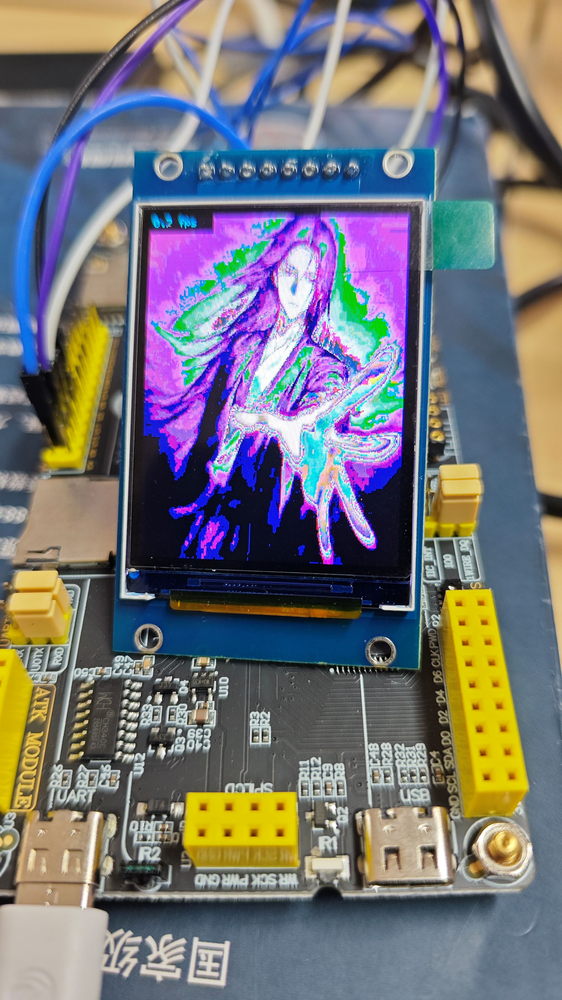
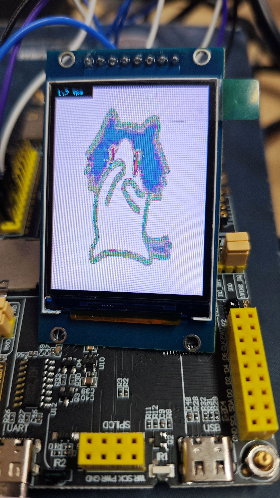

# TFT WiFi 视频流

电脑把视频/图片逐帧通过 WiFi 发到 ESP32-S3，ESP32 接收后解码显示在 TFT 彩屏上。

- **ESP32 端**：起一个 WebServer，接收 POST 上来的 JPEG 帧，用 TJpg_Decoder 解码刷屏
- **电脑端**：Python 脚本用 OpenCV 读视频/图片，逐帧编码成 JPEG，HTTP POST 给 ESP32

## 接线

| TFT 引脚 | ESP32-S3 GPIO |
|---|---|
| DC | GPIO7 |
| SCK | GPIO18 |
| SDA | GPIO16 |
| CS | GPIO10 |

## 跑起来

### 1. 改 WiFi 账号

打开 `TFT_WiFi_Stream.ino`，改成你自己的 WiFi：

```cpp
const char* ssid = "你的WiFi名";
const char* password = "你的WiFi密码";
```

### 2. ⚠️ WiFi 必须是 2.4G

ESP32-S3 **不支持 5G WiFi**。如果家里路由器是双频合一的，要么分开 2.4G/5G，要么直接**用电脑开移动热点**（Windows：设置 → 网络 → 移动热点），热点默认就是 2.4G，最省事。

### 3. 烧录 ESP32，看屏幕上的 IP

烧录后 TFT 会先显示 `WiFi Connecting...`，连上后屏幕会打印一行 IP，类似：

```
WiFi OK!
192.168.137.81
电脑运行 send_video.py
```

串口（115200）也会打印同一个 IP。**这一步的 IP 记下来，下一步要用。**

### 4. 改电脑端脚本

打开 `send_video.py`，改两处：

```python
VIDEO_PATH = r"你的视频文件路径.mp4"   # 改成自己的视频
ESP_IP = "192.168.137.81"             # 改成上一步屏幕上显示的 IP
```

装依赖：

```
pip install opencv-python requests
```

然后运行：

```
python send_video.py
```

TFT 上就会开始播放视频了。

## 效果图

电脑推流视频到 TFT 彩屏实时播放：





## 常见问题

### 电脑端报连接失败 / 超时

**99% 是 IP 变了。** ESP32 是 DHCP 动态拿 IP 的，每次重新上电、重新连 WiFi，IP 都可能变。

回去看一眼 TFT 屏幕当前显示的 IP，更新 `send_video.py` 里的 `ESP_IP`，再跑一次。

### 连不上 WiFi

- 确认 WiFi 是 2.4G，不是 5G
- 确认 ssid 和密码没错（注意大小写）
- 用电脑开热点的话，确认电脑和 ESP32 连的是同一个热点

### 另外两个脚本

- `send_image.py`：发一张静态图片到屏幕
- `send_gif.py`：发 GIF 动图循环播放

用法一样，改里面的 IP 和文件路径即可。
